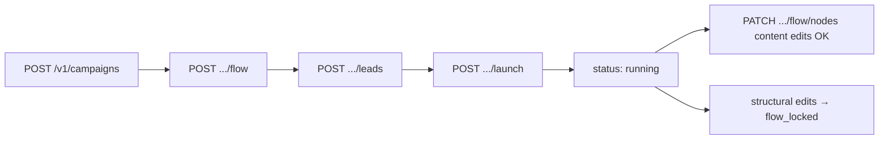

A Furnace campaign is an outbound sequence for a set of leads: a **flow graph** (emails, waits, categorizer branches, webhooks), one or more **mailboxes**, an optional **schedule**, and **leads** imported before launch.

Lifecycle: **draft** → `POST /launch` → **running** → `PATCH /status` for pause/resume/stop. Running allows copy/config edits but blocks structural topology changes; pause to restructure; stopped campaigns are fully locked.

For field-level flow object docs see [Flow schemas](/docs/guides/flow-schemas/) and the API reference models ([CampaignFlow](/docs/reference/schemas/CampaignFlow/), [FlowUpdate](/docs/reference/schemas/FlowUpdate/)).

## TL;DR — checklist

1. `GET /v1/mailboxes` — pick real mailbox UUIDs (no default mailbox alias)
2. `POST /v1/campaigns` — create draft; optional `flow`, `mailbox_ids`, `schedule`
3. `POST /v1/campaigns/{id}/flow` — save flow; check `field_sync` in the response
4. `POST /v1/campaigns/{id}/leads` — import leads
5. `GET /v1/campaigns/{id}?include=launch_state,lead_field_state` — verify readiness
6. `POST /v1/campaigns/{id}/launch` — enroll all leads and start

After launch, use `PATCH /v1/campaigns/{id}/status` (not `/launch`) for pause/resume/stop.

## Four phases

| Phase | Endpoint | What happens |
| --- | --- | --- |
| 1. Create draft | `POST /v1/campaigns` | New campaign with `status: draft`. Optional initial flow, mailboxes, tags, schedule. |
| 2. Save flow | `POST /v1/campaigns/{id}/flow` | Furnace normalizes, validates, and persists the graph. |
| 3. Upload leads | `POST /v1/campaigns/{id}/leads` or `.../leads/bulk` | Upsert leads; custom fields from the flow are required in `custom_lead_data`. |
| 4. Launch | `POST /v1/campaigns/{id}/launch` | Backfills enrollments, switches to `running`. |

Next: [Campaign flow](/docs/guides/campaign-flow/) (field_sync, If-Match) → [Campaign launch](/docs/guides/campaign-launch/) (lifecycle and walkthrough).
