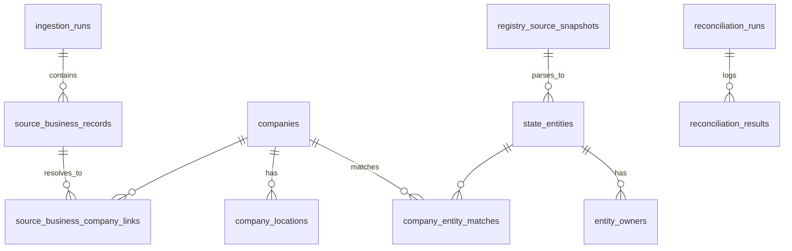

# Data model (conceptual)

This page describes **layers and relationships**. Column-level detail lives in [../schema/schema-overview.md](../schema/schema-overview.md) and [../schema/tables/](../schema/tables/).

## Raw layer

**Tables:** `ingestion_runs`, `source_business_records`

**Role:** Capture **what came in** from each source batch: configuration, run status, and one row per observed business with `raw_payload`. No assumption that a row is unique globally or already deduplicated.

## Canonical layer

**Tables:** `companies`, `company_locations`

**Role:** Your **internal** company record and optional addresses/enrichment (`normalized_address_key`, geocodes, confidence placeholders). `companies.normalized_key` is a **matching aid**, indexed but **not** globally unique (collisions allowed until dedupe/clustering improves).

## Registry layer

**Tables:** `registry_source_snapshots`, `state_entities`, `state_entity_history`

**Role:** **Evidence** (`snapshots`) and **parsed registry entities** (`state_entities`). Registry entities are not merged into `companies` by default; they are matched explicitly in the next layer.

## Matching layer (two problems)

**Layer 1 — Source resolution:** `source_business_company_links`, `source_business_company_link_history`

Links **`source_business_records`** → **`companies`**.

**Layer 2 — Reconciliation:** `company_entity_matches`, `company_entity_match_history`, `reconciliation_runs`, `reconciliation_results`

Links **`companies`** → **`state_entities`**, with run-level logging.

These must stay separate: different inputs, statuses, and uniqueness rules.

## Workflow layer

**Tables:** `review_tasks`

**Role:** Human queue; polymorphic pointer to the object under review (`entity_type`, `entity_id`).

## Audit layer

**Tables:** `company_history`, `company_location_history`, `state_entity_history`, `entity_owner_history`, `company_entity_match_history`, `source_business_company_link_history`

**Role:** Versioned **prior** row snapshots on update. Complements immutable snapshots and reconciliation logs.

## Ownership (cross-cutting)

**Tables:** `entity_owners`, `entity_owner_history`

**Role:** Parsed officers/owners tied to **`state_entities`**. Not yet a global `people` table; normalization fields support future deduplication.

## Why there are two distinct matching problems

| Aspect | Source resolution | Reconciliation |
|--------|-------------------|----------------|
| From | External listing/scrape row | Canonical company |
| To | Internal `companies` | Registry `state_entities` |
| Statuses | `candidate`, `linked`, `rejected` | `candidate`, `promoted`, `rejected` |
| Key invariant | One current `linked` per source row | One current `promoted` per company per `registry_state` |

## Relationship summary

## Related

- [../product/core-concepts.md](../product/core-concepts.md) — term definitions
- [../schema/schema-overview.md](../schema/schema-overview.md) — table groups and constraints index
