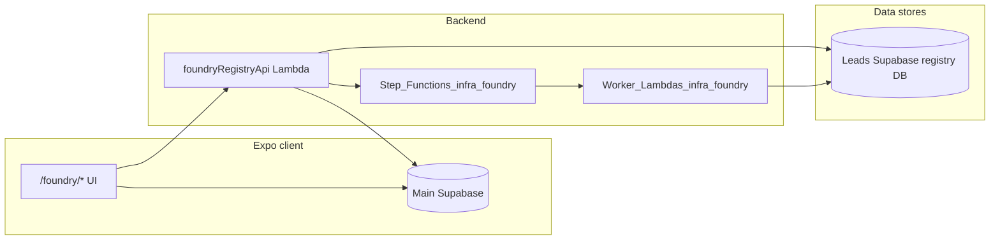

# System architecture

## High-level architecture

- **Main Supabase** (`supabase/`): app auth, `users`, `user_access_flags` (`flag_key = 'foundry'` for UI access), campaigns, etc.
- **Leads / registry Supabase** (`supabase-leads/`): all Foundry tables listed in [../overview.md](../overview.md), including **`foundry_jobs`** for async job polling.
- **Foundry UI**: Expo routes under `app/(foundry)/` gated by the main DB flag (see [`app/(foundry)/README.md`](../../../app/(foundry)/README.md)).
- **Registry API**: AWS Amplify Lambda **Function URL** validates the user’s Supabase JWT against the **main** project, checks `user_access_flags`, then uses **service role** credentials to read/write the registry DB ([SUPABASE_LEADS.md](../../infrastructure/SUPABASE_LEADS.md)). Extended routes cover source-record normalization, layer-1 resolution, review actions, and **mock** state-matching orchestration ([../engineering/registry-api.md](../engineering/registry-api.md)).
- **Async orchestration**: CDK app **`infra/foundry`** — Step Functions + worker Lambdas (normalization today; bulk/state stubs). Deploy and env wiring: [FOUNDRY_ORCHESTRATION.md](../../infrastructure/FOUNDRY_ORCHESTRATION.md). Overview: [../engineering/services-and-jobs.md](../engineering/services-and-jobs.md).

## Server-side auth model

1. User signs in with **main** Supabase Auth (normal app flow).
2. Client calls **registry API** with JWT (Bearer).
3. Lambda verifies JWT and loads user id; confirms **`user_access_flags`** row for `foundry`.
4. Lambda uses **`LEADS_SUPABASE_SECRET_KEY`** (service role) for PostgREST or DB access to **`supabase-leads`**.

The registry project does **not** depend on Supabase Auth for its tables; cross-database references (`changed_by`, `assigned_to`) are UUIDs without FKs.

## Database role in the system

The registry database is the **system of record** for ingestion, canonical companies, registry evidence, matches, and review tasks. Application code (Lambda, future workers, one-off scripts) should be the only writer in production; **RLS** is enabled with **no** policies for `anon` / `authenticated`, and broad grants are revoked so PostgREST roles cannot read sensitive tables by default ([`20260324100000_registry_views_checks_grants.sql`](../../../supabase-leads/supabase/migrations/20260324100000_registry_views_checks_grants.sql)).

## Ingestion pipeline

Creates **`ingestion_runs`** and **`source_business_records`**. Validates or normalizes in application code; failures recorded on the run (`status`, `error_summary`, `stats`). See [../workflows/ingest-source-data.md](../workflows/ingest-source-data.md).

## Matching pipeline (layer 1)

Produces **`source_business_company_links`** (`candidate` → `linked` / `rejected`). Enforces at most one current **`linked`** row per source record. See [../workflows/resolve-raw-to-company.md](../workflows/resolve-raw-to-company.md).

## Registry lookup pipeline

Writes **`registry_source_snapshots`**, then parsers create **`state_entities`** and **`entity_owners`**. Snapshots are append-only by convention. See [../workflows/registry-lookup-and-parse.md](../workflows/registry-lookup-and-parse.md).

## Matching pipeline (layer 2)

**Reconciliation** jobs create/update **`company_entity_matches`** and log **`reconciliation_runs`** / **`reconciliation_results`**. Partial unique index enforces at most one current **`promoted`** match per `(company_id, registry_state)`. See [../workflows/reconcile-company-to-state-entity.md](../workflows/reconcile-company-to-state-entity.md).

## Review workflow

Automation or humans create **`review_tasks`**; resolution updates links, matches, or parsing follow-ups. See [../workflows/review-and-adjudication.md](../workflows/review-and-adjudication.md).

## History / audit model

`BEFORE UPDATE` triggers copy the **previous** row into `*_history` as JSONB. **`registry_source_snapshots`** remain immutable evidence. Reconciliation outcomes live in **`reconciliation_results`**.

## Why the schema is separated into layers

Each layer answers a different question: what did we **ingest**, what do we **believe**, what did the **registry say**, how did we **associate** them, and what needs **human** attention. Mixing layers would collapse provenance and make constraints (e.g. per-state promoted match) impossible to express cleanly.

## Related

- [data-model.md](data-model.md) — conceptual ER-style grouping
- [../engineering/security-and-access.md](../engineering/security-and-access.md) — secrets and RLS
