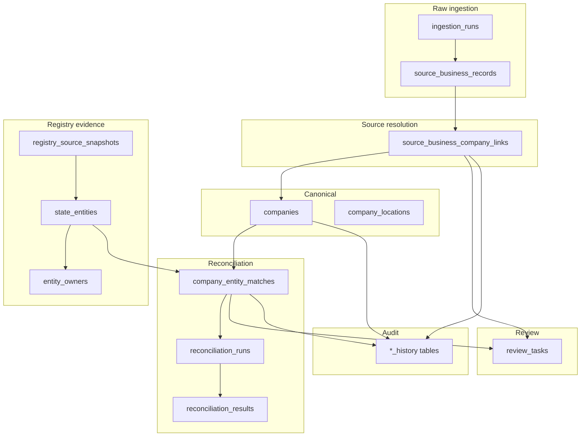

# Foundry overview

Foundry is an internal **company intelligence** subsystem: it ingests raw business records from external sources, resolves them to **canonical companies**, fetches and stores **state registry** evidence, **reconciles** canonical companies to registry entities, extracts **owners**, and routes ambiguity into a **human review** queue—with **history** and **constraints** so workflows stay auditable and correct.

Operational Supabase setup (CLI workdir, env vars, Lambda) is summarized in [SUPABASE_LEADS.md](../infrastructure/SUPABASE_LEADS.md). This tree focuses on concepts, schema, and workflows.

## What Foundry is

A pipeline-backed data system (PostgreSQL in a **separate** Supabase project, `supabase-leads/`) plus app surfaces under `/foundry/*` and a small **server-side** registry API. The Expo client does **not** query registry tables directly; access goes through backend code using the **service role** (see [engineering/security-and-access.md](engineering/security-and-access.md)).

## Why Foundry exists

- **Raw listings are messy:** Names, addresses, and IDs differ by source; you need a durable place to store what arrived (`source_business_records`) before you trust any “one true” company row.
- **Ownership often needs registry proof:** Canonical company identity and what a state registry says about an entity are **different concerns**; matching them is explicit, versioned, and sometimes ambiguous.
- **Operators need auditability:** Important mutable rows archive to `*_history` on update; registry pulls are stored as **immutable snapshots** for re-parse and evidence.

## Core workflow in one paragraph

Start an **ingestion run** and append **source business records**. Automated or assisted **linking** proposes `source_business_company_links` (`candidate` → `linked` or `rejected`) until each source row has at most one current **linked** company. Separately, registry **lookups** append rows to `registry_source_snapshots`; parsers create `state_entities` and `entity_owners`. A **reconciliation** job scores canonical companies against registry entities, writing `company_entity_matches` and logging `reconciliation_runs` / `reconciliation_results`. Ambiguity or failures become `review_tasks` for humans; successful paths still leave a trail in history and run logs.

## Major system layers

- **Raw ingestion:** Batches and immutable-ish raw rows from each source pull.
- **Canonical company:** Your internal “best known” company and locations.
- **Source resolution:** First matching problem—raw record → company (`source_business_company_links`).
- **Registry evidence:** Immutable snapshots and parsed `state_entities` (not the same as canonical companies).
- **Reconciliation:** Second matching problem—company → registry entity (`company_entity_matches` + run logs).
- **Ownership:** `entity_owners` tied to registry entities; normalization fields prepare for a future people model.
- **Review:** `review_tasks` for adjudication when automation is unsure.
- **Audit / history:** `*_history` tables, snapshots, and reconciliation results.

## Two distinct matching layers

1. **Raw → canonical:** `source_business_company_links` connects `source_business_records` to `companies`. Statuses: `candidate`, `linked`, `rejected`. Only **one** current `linked` row per source record is allowed (partial unique index).
2. **Canonical → registry entity:** `company_entity_matches` connects `companies` to `state_entities`. Statuses: `candidate`, `promoted`, `rejected`. Only **one** current `promoted` row per `(company_id, registry_state)` is allowed; `registry_state` is denormalized from the entity for this constraint.

Details: [product/core-concepts.md](product/core-concepts.md), [schema/tables/source-resolution.md](schema/tables/source-resolution.md), [schema/tables/reconciliation.md](schema/tables/reconciliation.md).

## Key design decisions

| Decision | Rationale |
|----------|-----------|
| Separate raw from canonical | Preserve source truth; allow re-linking and provenance without rewriting imports. |
| Separate canonical companies from registry entities | State registry rows are evidence with their own lifecycle and parsers, not “the same row” as internal companies. |
| Two matching layers | Different inputs, rules, and invariants; conflating them breaks auditing and constraints. |
| Immutable registry snapshots | Every pull is evidence; re-parse can target a stable `registry_source_snapshots` row. |
| History tables for mutable core rows | `BEFORE UPDATE` archives the **previous** row into `*_history` (JSONB snapshot). |
| DB constraints for workflow edges | Partial unique indexes and CHECKs enforce “one linked per source,” “one promoted per company per state,” etc. |
| Server-side access | Service role + backend API; RLS on with no policies for anon/authenticated on registry tables. |

## Main entity groups (at a glance)

| Group | Tables |
|-------|--------|
| Raw ingest | `ingestion_runs`, `source_business_records` |
| Canonical | `companies`, `company_locations` |
| Source resolution | `source_business_company_links`, `source_business_company_link_history` |
| Registry | `registry_source_snapshots`, `state_entities`, `state_entity_history` |
| Reconciliation | `company_entity_matches`, `company_entity_match_history`, `reconciliation_runs`, `reconciliation_results` |
| Owners | `entity_owners`, `entity_owner_history` |
| Review | `review_tasks` |

## Main workflows

- [workflows/ingest-source-data.md](workflows/ingest-source-data.md)
- [workflows/resolve-raw-to-company.md](workflows/resolve-raw-to-company.md)
- [workflows/registry-lookup-and-parse.md](workflows/registry-lookup-and-parse.md)
- [workflows/state-entity-matching.md](workflows/state-entity-matching.md) — batch operator flow: queue → preflight → orchestrated state runners → reconcile
- [workflows/reconcile-company-to-state-entity.md](workflows/reconcile-company-to-state-entity.md)
- [workflows/review-and-adjudication.md](workflows/review-and-adjudication.md)

## Documentation map

### Product

- [product/problem-and-goals.md](product/problem-and-goals.md) — problem, success, non-goals
- [product/core-concepts.md](product/core-concepts.md) — glossary (shared vocabulary)
- [product/entity-resolution-operator-guide.md](product/entity-resolution-operator-guide.md) — layer-1/layer-2 + review, happy/ambiguous/error paths
- [product/admin-ui-outline.md](product/admin-ui-outline.md) — screens under `/foundry/*`

### Architecture

- [architecture/system-architecture.md](architecture/system-architecture.md) — components and boundaries
- [architecture/data-model.md](architecture/data-model.md) — conceptual layers and relationships

### Schema

- [schema/schema-overview.md](schema/schema-overview.md) — philosophy and table groups
- [schema/tables/raw-ingestion.md](schema/tables/raw-ingestion.md)
- [schema/tables/canonical-company.md](schema/tables/canonical-company.md)
- [schema/tables/source-resolution.md](schema/tables/source-resolution.md)
- [schema/tables/registry-and-entities.md](schema/tables/registry-and-entities.md)
- [schema/tables/reconciliation.md](schema/tables/reconciliation.md)
- [schema/tables/owners.md](schema/tables/owners.md)
- [schema/tables/review-queue.md](schema/tables/review-queue.md)
- [schema/views-and-triggers.md](schema/views-and-triggers.md)
- [schema/indexes-and-constraints.md](schema/indexes-and-constraints.md)

### Engineering and operations

- [engineering/status-vocabularies.md](engineering/status-vocabularies.md) — allowed string literals (keep in sync with DB + TypeScript)
- [engineering/security-and-access.md](engineering/security-and-access.md)
- [engineering/services-and-jobs.md](engineering/services-and-jobs.md) — Lambda modules and future workers
- [engineering/registry-api.md](engineering/registry-api.md) — Foundry Function URL routes
- [engineering/future-evolution.md](engineering/future-evolution.md)
- [operations/runbooks.md](operations/runbooks.md)

### External reference

- [SUPABASE_LEADS.md](../infrastructure/SUPABASE_LEADS.md) — CLI, env vars, grants
- Migrations: `supabase-leads/supabase/migrations/*.sql`
