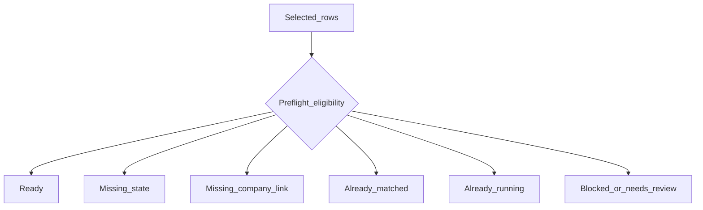
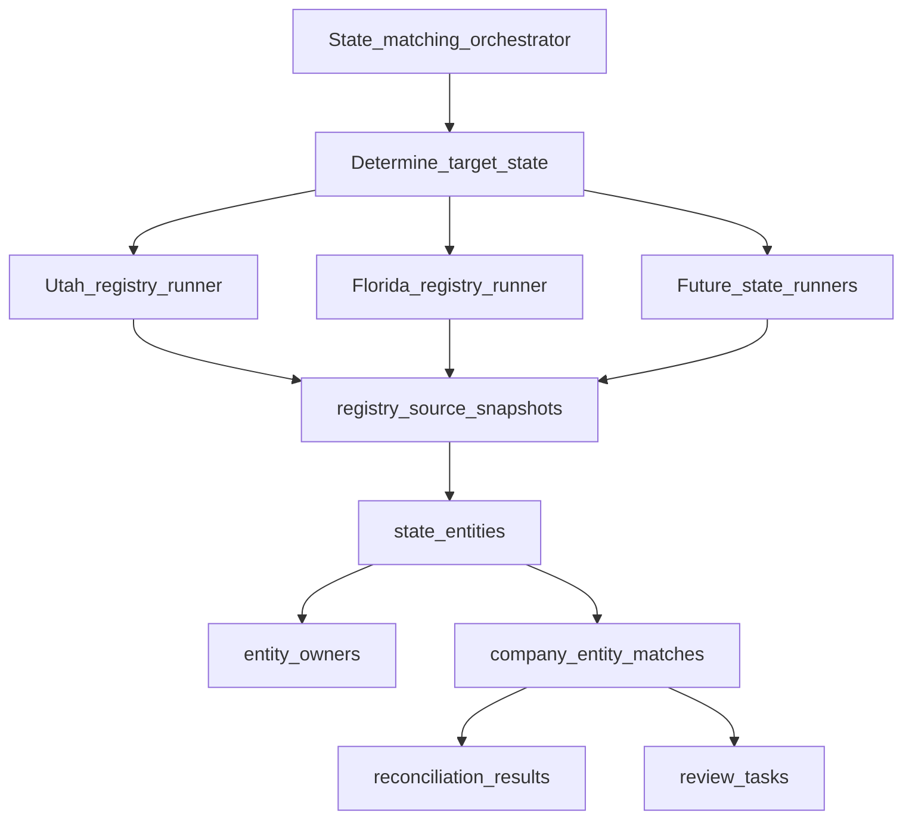
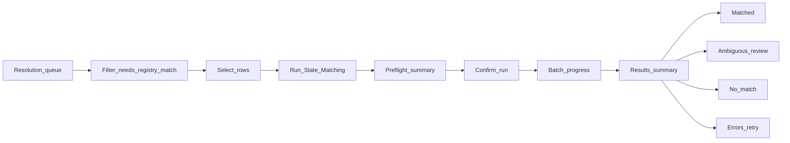

# Workflow: State entity matching (batch)

**Summary:** Operators select unresolved businesses in batch; an orchestrator determines each company’s target registry state, dispatches the correct state-specific registry flow, then scores and reconciles matches—auto-promoting when confident and routing ambiguity to review.

## Goal

Allow an operator to select a set of unresolved raw businesses (or companies that still need a registry match), run **state-entity matching** on them in batch, and let the system automatically choose the correct state-specific lookup and parser flow for each record.

The operator should think: *“Take these unresolved businesses and try to find the correct state registry entities and owners.”*  
They should **not** normally think: *“I need to manually pick Utah vs Florida logic for each one.”*

## Core mental model

1. The user starts from **unresolved or underspecified source context** (queue rows that represent work still to do).
2. The user selects some or all of them.
3. The system **resolves to canonical companies** when needed (linking layer).
4. A **runner** inspects each company’s best-known location / state.
5. The runner **chooses the correct state lookup flow** automatically (connector + parser).
6. The system stores **registry evidence** (`registry_source_snapshots`) and parsed **`state_entities`** / **`entity_owners`**.
7. The system **scores** candidate state entities against the company.
8. The system **promotes**, **rejects**, or **flags ambiguous** matches.
9. Ambiguous cases go to **review** (`review_tasks`).

### User-facing vs system-facing

- **User-facing:** “Run state matching on these **unresolved businesses**.”
- **System-facing:** The batch ultimately runs against **canonical `companies`**, using the **best known target registry state** for each. State-entity matching is **company → state_entity**, not raw row → state_entity.

The queue may **display** source business rows for operational clarity, but execution, scoring, and promotion are anchored on **companies** (and `registry_state` on matches).

## High-level batch flow

```mermaid
flowchart LR
  unmatched[Unmatched_or_needs_match_rows]
  selectBatch[Select_batch]
  runMatching[Run_state_matching]
  resolveState[Resolve_target_state_per_company]
  dispatch[Dispatch_state_runner]
  snapshot[Fetch_registry_snapshot]
  parse[Parse_entities_and_owners]
  score[Score_company_to_candidates]
  reconcile[Promote_or_reject]
  store[Store_results]
  review[Review_ambiguous]

  unmatched --> selectBatch
  selectBatch --> runMatching
  runMatching --> resolveState
  resolveState --> dispatch
  dispatch --> snapshot
  snapshot --> parse
  parse --> score
  score --> reconcile
  reconcile --> store
  reconcile --> review
```

## Operator actions

### Starting queue

Typical entry points:

- Unresolved **source business** records (still need work toward registry truth).
- Companies **linked** from source data but **without** a promoted state match for the inferred registry state.
- Companies needing **owner resolution** via registry (downstream of entity match).

### Selection modes

- Single row  
- Multi-select  
- “Current filtered set”  
- “Run on all eligible” (within safety limits)

### Primary action

- **Run State Matching** — kicks off preflight, then the orchestrated pipeline for all **ready** companies.

### Manual state override (v1)

Choosing Utah vs Florida **manually** is **not** part of the normal operator workflow in v1. It may exist later as an **advanced / debug** action only.

## What the system decides automatically

For each **ready** company, the system determines:

| Decision | Based on |
|----------|----------|
| **Target registry state** | Canonical primary / best location; fallback raw address; conflict handling (see below) |
| **Registry connector / flow** | e.g. Utah vs Florida (extensible list) |
| **Lookup key strategy** | Legal name, normalized name variants; address or domain as **secondary signals**, not primary registry keys unless a state flow supports it |
| **Parser version** | Per-state module version tied to snapshot parse |

## Eligibility rules (batch)

A row is **eligible** to run when:

- It is **linked** to a canonical **company** (or preflight will skip with “missing company link”).
- The company does **not** already have a **current promoted** `company_entity_matches` row for that **target `registry_state`** (or product policy allows re-run; default v1: skip “already matched” for that state).
- The company has **enough location / state signal** to determine a single target registry state (or preflight sends conflicting / missing cases to skip or review).
- The company is **not** already part of a **running** state-match job (concurrency guard).

**Optional:** skip companies explicitly marked reviewed as **no registry match** for that state, if you add such a flag or task outcome.

## Batch preflight

Before execution, evaluate **each selected row** and bucket:

- **Ready** — will run in this batch  
- **Missing state / location** — cannot infer registry state  
- **Missing company link** — still at raw → company layer  
- **Already matched** — promoted current match exists for target state  
- **Already running** — in-flight job  
- **Blocked by review** — policy holds automation (optional)

The operator should see **how many will run**, **how many skipped**, and **why** skipped rows were skipped.

## State determination (explicit priority)

Suggested order for **target registry state**:

1. **`company_locations`** where **`is_primary = true`** (if present and state known).  
2. Fallback: **best current** company location (product-defined: e.g. highest confidence, most recent).  
3. Fallback: **state parsed from raw source** address on the queue row / linked source record.  
4. If **multiple conflicting** states are equally plausible → **do not auto-run**; send to **review** (or skip with reason).  
5. If **no state** can be derived → **do not run**; preflight skip reason “missing state.”

Documenting this order avoids hidden behavior when primary location and source disagree.

## Runner orchestration

**Orchestrator** (single coordination layer):

- Accept batch input (company ids + optional source context).  
- Run **preflight** and produce the runnable set.  
- For each company: determine **target state**, pick **state module**, invoke **lookup + parse**, then invoke **scoring / reconciliation**.  
- Record **`reconciliation_runs`** / **`reconciliation_results`**; create **`review_tasks`** when needed.  
- Aggregate progress and terminal buckets for UI.

**State runner** (pluggable per state):

- Perform registry **lookup**.  
- Insert **`registry_source_snapshots`**.  
- Parse **`state_entities`** and **`entity_owners`**.  
- Return **candidate entities** (and errors) to the orchestrator for scoring.

Persistence details for snapshot → parse → match logging align with [registry-lookup-and-parse.md](registry-lookup-and-parse.md) and [reconcile-company-to-state-entity.md](reconcile-company-to-state-entity.md).

## Per-state runner internals

State modules follow the **registry lookup and parse** workflow: immutable snapshots, parser versioning, entity and owner rows. See [registry-lookup-and-parse.md](registry-lookup-and-parse.md).

## Candidate scoring and reconciliation

Scoring compares the **canonical company** to **candidate `state_entities`** for the target state. Typical inputs:

- Legal / display name vs registry **legal name**  
- Normalized name similarity  
- State alignment (must match target)  
- Address / proximity when available  
- Weak hints (e.g. domain) — scoring only, not a substitute for registry lookup keys unless supported  

**Reconciliation outcomes** (`reconciliation_results.outcome`): `matched`, `no_match`, `ambiguous`, `error`.  

**Match rows** (`company_entity_matches.match_status`): `candidate`, `promoted`, `rejected` — with at most **one current promoted** match per **`(company_id, registry_state)`** (see [../schema/tables/reconciliation.md](../schema/tables/reconciliation.md)).

Step-by-step reconciliation mechanics: [reconcile-company-to-state-entity.md](reconcile-company-to-state-entity.md).

## Result handling

| Path | Behavior |
|------|----------|
| **High confidence** | Update `company_entity_matches`; **promote** one current match for that company/state; write `reconciliation_results`; refresh `entity_owners` as parsed |
| **Ambiguous** | Candidate matches, **no** auto-promote; create **`review_tasks`** (e.g. `entity_match_review`) |
| **No match** | `reconciliation_results` with `no_match`; optional review task if operationally required |
| **Error** | `reconciliation_results` / run metadata with `error`; surface **retry** for operator or job |

## UI-oriented flow (product)

### Suggested screens (v1)

- **Queue** — rows with business name, linked company, primary/target state, link status, match status, review status; CTA **Run State Matching**.  
- **Preflight** — selected vs runnable vs skipped + reasons; CTA **Start run**.  
- **Progress** — run status, counts (in progress, matched, ambiguous, no match, failed).  
- **Results** — buckets with drill-down; actions to open review, retry failures.

### Derived status labels (UI)

Examples: Not started, Ready, Running, Matched, Ambiguous, No match, Error, Review required. Not every label requires a dedicated DB column; some are **derived** from `reconciliation_runs`, `reconciliation_results`, `company_entity_matches`, and `review_tasks`.

## v1 scope (opinionated)

**Include**

- Batch selection from a queue  
- Automatic **target state** determination  
- Automatic **state-runner** dispatch  
- Snapshot storage, entity and owner parsing  
- Candidate scoring and reconciliation  
- Auto-**promote** when confidence is high enough  
- **Review tasks** for ambiguous cases  
- **One target registry state per company per run** (simpler mental model and debugging)

**Exclude (for now)**

- Manual per-state flow picker in the default path  
- Multi-state matching in a single pass for one company  
- Advanced rule builder  
- Operator-configurable scoring thresholds in UI  
- Manual connector selection  

**Future:** “Run additional states” or “search all known operating states” for a company.

## Retry and expansion

- **Retry:** failed or errored companies re-enter the queue or a dedicated retry action; new snapshots preferred over mutating old evidence rows.  
- **Expansion:** more state modules, richer scoring, optional multi-state runs, debug overrides.

## Related workflows

- [resolve-raw-to-company.md](resolve-raw-to-company.md) — linking before match when source rows are not yet tied to a company  
- [registry-lookup-and-parse.md](registry-lookup-and-parse.md) — per-state fetch, snapshot, parse  
- [reconcile-company-to-state-entity.md](reconcile-company-to-state-entity.md) — scoring, promotion, run logging  
- [review-and-adjudication.md](review-and-adjudication.md) — human follow-up  

## Related schema

- [../schema/tables/reconciliation.md](../schema/tables/reconciliation.md)  
- [../schema/tables/registry-and-entities.md](../schema/tables/registry-and-entities.md)  
- [../schema/tables/canonical-company.md](../schema/tables/canonical-company.md)  
- [../schema/tables/review-queue.md](../schema/tables/review-queue.md)  

Concept glossary: [../product/core-concepts.md](../product/core-concepts.md).
