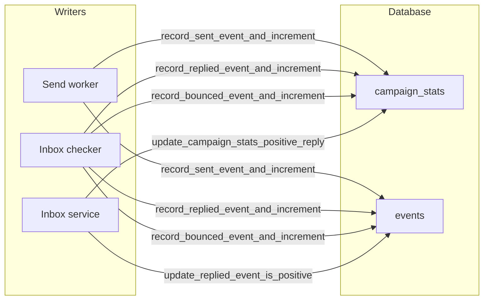

# Campaign stats calculations

This document explains how campaign statistics (sent, replied, positive reply, bounce) are defined, updated, and read. Use it to debug inconsistencies or to understand the system.

---

## Overview

Campaign stats are **totals** (sent, replied, positive reply, bounce) plus **enrollment count** and optional **per-day series** for charts. They appear on the campaigns list, campaign detail page, and in the stats-by-day chart.

Two storage layers back these numbers:

- **campaign_stats** — Cached totals, one row per campaign. Updated incrementally by workers and the inbox service. Used for list and detail totals.
- **events** — Immutable log of `sent`, `replied`, and `bounced` events. Used only for per-day aggregation (charts).

Event insert and stats increment are **atomic**: a single RPC per stat type inserts the event and updates campaign_stats in one transaction, so the two tables do not drift. List and detail totals read from **campaign_stats** (and enrollments for enrollment count). Per-day charts read from **events**. The diagram in [Who updates what](#who-updates-what) and the [Stat definitions](#stat-definitions) below spell out who writes each stat and what it means.

---

## Stat definitions

### Sent

A **campaign email was successfully sent**. Counted when the send-worker marks a **campaign** `message_job` as `sent`. Excludes `inbox_reply` and `inbox_forward` jobs.

- **Source of truth for backfill:** `message_jobs` where `status = 'sent'` and `message_type = 'campaign'` (or null).
- **Code:** Send worker calls `record_sent_event_and_increment` for campaign jobs only (`isCampaignMessageJob`); that RPC inserts the `sent` event and increments `sent_count` in one transaction. See [workers/send-worker/src/worker.ts](../../../workers/send-worker/src/worker.ts). Backfill logic: [supabase/migrations/20260216000002_backfill_campaign_stats.sql](../../../supabase/migrations/20260216000002_backfill_campaign_stats.sql).

### Replied

**First reply to a campaign message** was detected. Counted once per thread when the inbox-checker creates the first `replied` event for that `message_job`. Excludes replies to inbox_reply/inbox_forward.

- **Source of truth for backfill:** `email_threads` with `has_reply = true` and `campaign_id` set.
- **Code:** [workers/inbox-checker-worker/src/thread-manager.ts](../../../workers/inbox-checker-worker/src/thread-manager.ts) — `isCampaignReply` check, then `record_replied_event_and_increment` (inserts `replied` event and increments stats in one transaction; idempotent via unique index).

### Positive reply

Subset of **replied** that are marked **Interested**. The only way a reply is counted as “positive” is when a **user** marks the thread as Interested (there is no auto-detection). At reply-detection time the inbox-checker passes `thread.category === 'Interested'` into the stats RPC, but the **event** row does not get `event_data.is_positive` until the user sets the thread category in the UI. When the user changes category, both `campaign_stats.positive_reply_count` (delta) and the replied event’s `event_data.is_positive` are updated so charts stay in sync.

- **Source of truth for backfill:** `email_threads` with `has_reply = true` and `category = 'Interested'`.
- **Code:** Same thread-manager block (`p_is_positive: isPositive`). User changes: [lib/supabase/services/inbox.ts](../../../lib/supabase/services/inbox.ts) `updateThreadCategory` → `update_campaign_stats_positive_reply` and `update_replied_event_is_positive`. Migration: [supabase/migrations/20260218000000_update_campaign_stats_positive_reply_by_delta.sql](../../../supabase/migrations/20260218000000_update_campaign_stats_positive_reply_by_delta.sql).

### Bounce

A **bounce was detected** for a Furnace campaign send that can be **matched** to a recent sent `message_job` for the same mailbox (failed-recipient email in the bounce lines up with the lead email on that job). Inbox-checker calls `record_bounced_event_and_increment` once per matched job. Each bounced event corresponds to one lead/message_job pair; **each event = one increment** to `bounce_count` (so multiple leads bouncing in the same campaign each add one).

- **Source of truth for backfill:** `events` where `event_type = 'bounced'` and `campaign_id`; `last_bounce_at` from max `created_at` of those events.
- **Unmatched bounces** (e.g. warmup mail or sends outside Furnace) are **not** written to `events`, do not change `campaign_stats`, and do not stop enrollments. They are logged as structured JSON with `tag: bounce_unmatched` for operators.
- **Code:** [workers/inbox-checker-worker/src/thread-manager.ts](../../../workers/inbox-checker-worker/src/thread-manager.ts) — `record_bounced_event_and_increment` (atomic event + increment) only after a positive recipient match.

### Enrollment count

Total **enrollments** for the campaign. Not stored in `campaign_stats`; computed in the app from the `enrollments` table.

- **Code:** [lib/supabase/services/campaigns.ts](../../../lib/supabase/services/campaigns.ts) — `getCampaignStatsForCampaigns` queries `enrollments` and merges with `campaign_stats`.

### Campaign list completion percentage

The completion dial on the campaign list uses a **blended formula** combining two independent signals:

- **Contacted count** — distinct enrollments that have at least one sent campaign email (`message_jobs` with `status = 'sent'` and campaign type). Computed efficiently via the `get_campaign_contacted_counts` RPC (DB-side `COUNT(DISTINCT enrollment_id) … GROUP BY campaign_id`).
- **Terminal count** — enrollments with `state` in (`stopped`, `completed`).

**Formula:** `(reachedCount + terminalCount) / (enrollmentCount × 2)`, capped at 100%, where **reachedCount = max(contactedCount, terminalCount)**. So enrollments that are terminal but have no sent campaign email (e.g. stopped before first send) still count as "reached" for the first half, and "all terminal" always shows 100%.

This gives two "halves" of progress: reaching people contributes up to 50%, and finishing them contributes the other 50%. When all enrollments are terminal, the value equals `enrollmentCount × 2`, yielding 100%.

| Scenario (100 enrollments) | Contacted | Terminal | Value | Completion |
|---|---|---|---|---|
| Campaign just started | 0 | 0 | 0 / 200 | **0%** |
| All reached, none done | 100 | 0 | 100 / 200 | **50%** |
| Half reached, some done | 50 | 30 | 80 / 200 | **40%** |
| All reached and done | 100 | 100 | 200 / 200 | **100%** |

Edge case: if there are no enrollments, total is set to 1 to avoid division by zero, resulting in 0%.

- **Code:** `getCampaignStatsForCampaigns` in [lib/supabase/services/campaigns.ts](../../../lib/supabase/services/campaigns.ts) computes `enrollmentCount`, `terminalEnrollmentCount`, and `contactedEnrollmentCount`. The `CampaignCard` in [app/(main)/campaigns.tsx](../../../app/(main)/campaigns.tsx) uses `reachedCount = max(contactedCount, terminalCount)` so enrollments that are terminal without a sent email still count, then passes `value = reachedCount + terminalCount` and `total = enrollmentCount * 2` (or 1) to `ProgressDial`.

---

## Data model

### campaign_stats

One row per campaign. Columns: `campaign_id`, `sent_count`, `replied_count`, `positive_reply_count`, `bounce_count`, `last_bounce_at`, `updated_at`. Created by a trigger on campaign insert; updated **only** via RPCs (no direct UPDATE from app or workers).

- **Migration:** [supabase/migrations/20260216000001_create_campaign_stats_and_events_mailbox_id.sql](../../../supabase/migrations/20260216000001_create_campaign_stats_and_events_mailbox_id.sql).

### events

Rows with `event_type` in `sent`, `replied`, `bounced`. For `replied`, `event_data.is_positive` is set **only when the user marks the thread as Interested** (via the UI); it is not set at reply-detection time. Events are used for **per-day aggregation only** (charts), not for the main totals. A unique partial index on `(campaign_id, message_job_id, event_type) WHERE event_type = 'replied'` ensures at most one `replied` event per message_job, preventing double-counting under concurrent workers.

---

## Who updates what

| Writer         | Updates campaign_stats                                      | Writes events                    |
|----------------|-------------------------------------------------------------|----------------------------------|
| Send worker    | `record_sent_event_and_increment` (campaign jobs only) — atomic event + sent_count | `sent`                           |
| Inbox checker  | `record_replied_event_and_increment`, `record_bounced_event_and_increment` — atomic event + count each | `replied`, `bounced`             |
| Inbox service  | `update_campaign_stats_positive_reply` (delta)              | updates `replied` event `event_data.is_positive` |

---

## How the app reads stats

- **List/card totals and campaign detail summary:** `getCampaignStatsForCampaigns(campaignIds)` in [lib/supabase/services/campaigns.ts](../../../lib/supabase/services/campaigns.ts). Makes three queries: `enrollments` (total + terminal counts per campaign), `get_campaign_contacted_counts` RPC (contacted count per campaign), and `campaign_stats` (sent/replied/positive_reply/bounce/last_bounce_at). Used by [app/(main)/campaigns.tsx](../../../app/(main)/campaigns.tsx) and [app/(main)/campaigns/[id].tsx](../../../app/(main)/campaigns/[id].tsx).

- **Per-day chart:** `getCampaignStatsByDay(campaignId, start, end)` in the same service. Queries **events** only (`event_type` in sent, replied, bounced), buckets by date; for replied, positive count uses `event_data.is_positive`. Used by [components/campaigns/CampaignStatsChart.tsx](../../../components/campaigns/CampaignStatsChart.tsx).

---

## Edge cases and consistency

- **Excluded from sent:** `message_jobs` with `message_type` `inbox_reply` or `inbox_forward` (see `isCampaignMessageJob` in send-worker).
- **Excluded from replied:** Replies to inbox_reply/inbox_forward (see `isCampaignReply` in thread-manager).
- **Positive reply is user-defined:** A reply counts as “positive” only when a user marks the thread as Interested. The per-day chart’s positive-reply count can lag until threads are categorized; that is expected, not a bug.
- **Positive reply can change:** User sets/clears “Interested” → `update_campaign_stats_positive_reply` (delta) and `update_replied_event_is_positive` so events stay in sync for per-day charts.
- **Bounce:** Each bounced event = one increment (one per matched lead/message_job). There is no attribution when the bounce cannot be matched to a Furnace send; those cases never create `bounced` events.
- **Atomicity:** Event insert and stats increment happen in a single RPC per type, so campaign_stats and events do not drift. If you ever need to correct drift (e.g. from an older code path), use `reconcile_campaign_stats` or the script below.

---

## Reconciliation and backfill

One-time backfill: [supabase/migrations/20260216000002_backfill_campaign_stats.sql](../../../supabase/migrations/20260216000002_backfill_campaign_stats.sql). It defines the canonical sources: **message_jobs** (sent), **email_threads** (replied + positive), **events** (bounce).

**Ongoing reconciliation:** The RPC `reconcile_campaign_stats(p_campaign_id)` recomputes campaign_stats from those same sources. Pass a campaign UUID to reconcile one campaign, or `NULL` to reconcile all. Returns the number of rows updated. The script [scripts/reconcile-campaign-stats.ts](../../../scripts/reconcile-campaign-stats.ts) calls this RPC and can be run manually or on a schedule (e.g. cron):

- `npx tsx scripts/reconcile-campaign-stats.ts` — reconcile all campaigns
- `CAMPAIGN_ID=<uuid> npx tsx scripts/reconcile-campaign-stats.ts` — reconcile one campaign

---

## Reference

### Migrations

- `20260216000001` — campaign_stats table + trigger + increment RPCs (sent, replied, bounce).
- `20260218000000` — positive_reply delta RPC + `update_replied_event_is_positive`.
- `20260216000002` — backfill campaign_stats from message_jobs, email_threads, events.
- `20260222120000` — atomic RPCs (record_sent/replied/bounced_event_and_increment), unique replied index, `reconcile_campaign_stats`.
- `20260222150000` — `get_campaign_contacted_counts` RPC + partial index on `message_jobs` for campaign completion dial.

### RPCs

- **Atomic (event + stats in one transaction):** `record_sent_event_and_increment`, `record_replied_event_and_increment`, `record_bounced_event_and_increment`.
- **Contacted count (completion dial):** `get_campaign_contacted_counts(p_campaign_ids UUID[])` — returns per-campaign count of distinct enrollments with ≥1 sent campaign email.
- **Reconciliation:** `reconcile_campaign_stats(p_campaign_id)` — pass NULL for all campaigns.
- **Positive reply (user override):** `update_campaign_stats_positive_reply(p_campaign_id, p_delta)`, `update_replied_event_is_positive(p_campaign_id, p_message_job_id, p_is_positive)`.
- **Legacy (still present, used by reconciliation):** `increment_campaign_stats_sent`, `increment_campaign_stats_replied`, `increment_campaign_stats_bounce` — workers now use the atomic RPCs above.

### Scripts

- [scripts/reconcile-campaign-stats.ts](../../../scripts/reconcile-campaign-stats.ts) — calls `reconcile_campaign_stats`; optional `CAMPAIGN_ID` env var.

### Key code

- **Types and reads:** [lib/supabase/services/campaigns.ts](../../../lib/supabase/services/campaigns.ts) — `CampaignStats`, `getCampaignStatsForCampaigns`, `getCampaignStatsByDay`.
- **Positive reply (user override):** [lib/supabase/services/inbox.ts](../../../lib/supabase/services/inbox.ts) — `updateThreadCategory`.
- **Sent:** [workers/send-worker/src/worker.ts](../../../workers/send-worker/src/worker.ts) — `record_sent_event_and_increment`.
- **Replied, bounce:** [workers/inbox-checker-worker/src/thread-manager.ts](../../../workers/inbox-checker-worker/src/thread-manager.ts) — `record_replied_event_and_increment`, `record_bounced_event_and_increment`.
