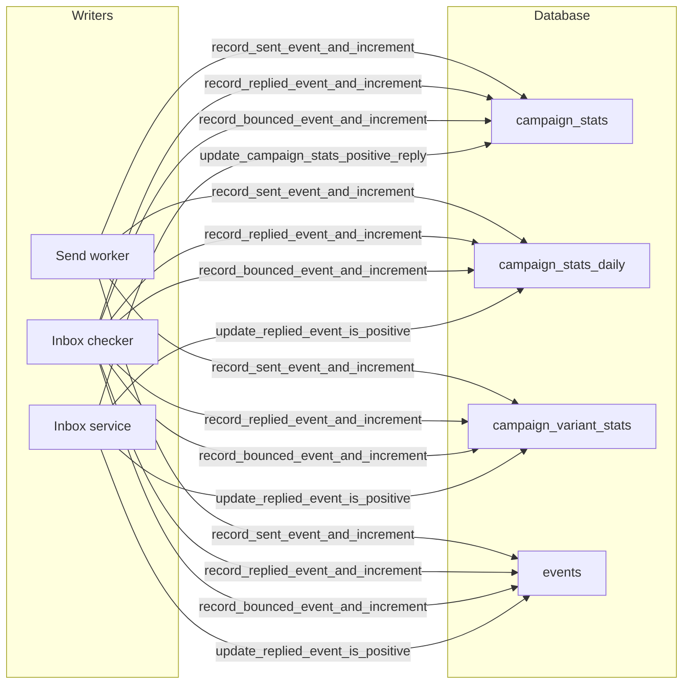

# Campaign stats calculations

This document explains how campaign statistics (sent, replied, positive reply, bounce) are defined, updated, and read. Use it to debug inconsistencies or to understand the system.

---

## Overview

Campaign stats are **totals** (sent, replied, positive reply, bounce) plus **enrollment count** and optional **per-day series** for charts. They appear on the campaigns list, campaign detail page, and in the stats-by-day chart.

Caches back these numbers (details never scan `message_jobs` or `events` on read):

- **campaign_stats** — Cached totals, one row per campaign. Updated incrementally by workers and the inbox service. Used for list totals and the details chart’s lifetime-sent cache-miss check.
- **campaign_stats_daily** — Cached **per UTC calendar day** counts (`sent`, `replied`, `positive_reply`, `bounce`, `leads_first_contacted`) for Furnace campaigns. Updated in the same transaction as `record_*_event_and_increment`, and rebuilt from **`events`** by `rebuild_campaign_stats_daily` / `reconcile_campaign_stats`. Used by `/metrics` and campaign-detail day charts.
- **campaign_variant_stats** — Cached lifetime per-`(node_id, variant_id)` counts for campaign details. Incremented in the same `record_*` RPCs; rebuilt by `rebuild_campaign_variant_stats` / `reconcile_campaign_stats`. Not a date-windowed store — `/metrics` `account_node_stats` still live-scans jobs.
- **enrollments.has_been_contacted** — Set once on first campaign send. The details progress dial and `enrollment_progress_state` read this flag (not `EXISTS` on `message_jobs`).
- **events** — Immutable log of `sent`, `replied`, and `bounced` events. Source of truth for daily/variant rebuilds and for **leads reached** (distinct `lead_id` in a date window, which is not additive from daily distincts).

Event insert and stats increment are **atomic**: a single RPC per stat type inserts the event and updates `campaign_stats`, `campaign_stats_daily`, and `campaign_variant_stats` in one transaction. Rebuilds (`rebuild_campaign_stats_daily`, `rebuild_campaign_variant_stats`) are migrate/ops only — never from the details page. The diagram in [Who updates what](#who-updates-what) and the [Stat definitions](#stat-definitions) below spell out who writes each stat and what it means.

---

## Stat definitions

### Sent

A **campaign outbound email was successfully sent**. Counted when the send-worker marks an outbound `message_job` as `sent`. Includes paced `campaign` jobs and post-categorizer priority jobs (`campaign_priority` / legacy `campaign_reply`). Excludes `inbox_reply` and `inbox_forward`.

- **Source of truth for backfill / reconcile:** `message_jobs` where `status = 'sent'` and `is_campaign_outbound_message_type(message_type)` (SQL; mirrors TS `isCampaignMessageJob`).
- **Code:** Send worker calls `record_sent_event_and_increment` for outbound jobs only (`isCampaignMessageJob`); that RPC inserts the `sent` event and increments `sent_count` in one transaction. See [workers/send-worker/src/worker.ts](../../../workers/send-worker/src/worker.ts). Backfill logic: [supabase/migrations/20260216000002_backfill_campaign_stats.sql](../../../supabase/migrations/20260216000002_backfill_campaign_stats.sql).

### Replied

**First reply to a campaign message** was detected. Counted once per thread when the inbox-checker creates the first `replied` event for that `message_job`. Excludes replies to inbox_reply/inbox_forward.

- **Source of truth for backfill:** `email_threads` with `has_reply = true` and `campaign_id` set.
- **Code:** [workers/inbox-checker-worker/src/thread-manager.ts](../../../workers/inbox-checker-worker/src/thread-manager.ts) — `isCampaignReply` check, then `record_replied_event_and_increment` (inserts `replied` event and increments stats in one transaction; idempotent via unique index).

### Positive reply

Subset of **replied** that are marked **Interested**. The only way a reply is counted as “positive” is when a **user** marks the thread as Interested (there is no auto-detection). At reply-detection time the inbox-checker passes `thread.category === 'Interested'` into the stats RPC, but the **event** row does not get `event_data.is_positive` until the user sets the thread category in the UI. When the user changes category, both `campaign_stats.positive_reply_count` (delta) and the replied event’s `event_data.is_positive` are updated so charts stay in sync.

- **Source of truth for backfill:** `email_threads` with `has_reply = true` and `category = 'Interested'`.
- **Code:** Same thread-manager block (`p_is_positive: isPositive`). User changes: [lib/supabase/services/inbox.ts](../../../lib/supabase/services/inbox.ts) `updateThreadCategory` → `update_campaign_stats_positive_reply` and `update_replied_event_is_positive`. Migration: [supabase/migrations/20260218000000_update_campaign_stats_positive_reply_by_delta.sql](../../../supabase/migrations/20260218000000_update_campaign_stats_positive_reply_by_delta.sql).

### Bounce

A **bounce was detected** for a Furnace campaign send that can be **matched** to a recent sent `message_job` for the same mailbox (failed-recipient email in the bounce lines up with the lead email on that job). Inbox-checker calls `record_bounced_event_and_increment` once per matched job. Each bounced event corresponds to one lead/message_job pair; **each event = one increment** to `bounce_count` (so multiple leads bouncing in the same campaign each add one).

- **Source of truth for backfill:** `events` where `event_type = 'bounced'` and `campaign_id`; `last_bounce_at` from max `created_at` of those events.
- **Unmatched bounces** (e.g. warmup mail or sends outside Furnace) are **not** written to `events`, do not change `campaign_stats`, and do not stop enrollments. They are logged as structured JSON with `tag: bounce_unmatched` for operators.
- **Code:** [workers/inbox-checker-worker/src/thread-manager.ts](../../../workers/inbox-checker-worker/src/thread-manager.ts) — `record_bounced_event_and_increment` (atomic event + increment) only after a positive recipient match.

### Smartlead-imported campaigns

Campaigns with `source = 'smartlead'` get totals from the Smartlead migration worker ([lib/smartlead/migration.ts](../../../lib/smartlead/migration.ts)), not from Furnace send/inbox workers.

- **Sent / bounce:** Smartlead analytics API → `campaign_stats` and `imported_campaign_stats_by_day`.
- **Replied / positive reply (list totals):** After conversations import, `finalizeImportedCampaignStats` sets `replied_count` and `positive_reply_count` to `MAX(analytics, imported thread counts)`. Smartlead’s inbox-replies API often reports more replies than analytics (e.g. includes OOO); thread count matches the Smartlead UI “Replied w/OOO” column.
- **Positive reply on threads:** Inbox-replies category is mapped to `email_threads.category` (`Interested`, etc.); interested thread count feeds the positive total above.
- **Per-day charts:** Still read `imported_campaign_stats_by_day` (analytics API only). Day-level replied/positive may be lower than list totals when analytics undercounts; list totals are authoritative for Smartlead parity.
- **Re-run:** Each migration run calls `clearSmartleadCampaignImportArtifacts` first (wipes leads, enrollments, threads, imported stats for that campaign) so the UI wizard can safely re-import all campaigns.

### Enrollment count

Total **enrollments** for the campaign. Not stored in `campaign_stats`; computed live from non-deleted `enrollments` rows.

- **Code:** For the **campaigns list**, [lib/supabase/services/campaigns/campaign-list-summary.ts](../../../lib/supabase/services/campaigns/campaign-list-summary.ts) — `getCampaignsListSummary` calls the `campaigns_list_summary` RPC (server-side aggregates; supports search/status/tag filters and keyset pagination). For other callers that still need merged totals + enrollment counts, [lib/supabase/services/campaigns/campaign-stats.ts](../../../lib/supabase/services/campaigns/campaign-stats.ts) — `getCampaignStatsForCampaigns` queries `enrollments` and merges with `campaign_stats`. **Campaign details does not call this** (it would download every enrollment). The details lead-progress dial uses `get_campaign_lead_progress_buckets` (set-based `COUNT` on `leads` ⟕ `enrollments` for that campaign).

### Campaign list completion percentage

The completion dial on the campaign list uses a **blended formula** combining two independent signals:

- **Contacted count** — enrollments with `has_been_contacted = true`. That flag is set once on the first campaign send via `record_sent_event_and_increment`, and can be reconciled from sent campaign `message_jobs` with `backfill_enrollment_has_been_contacted_batch` / [scripts/backfill-enrollment-has-been-contacted.ts](../../../scripts/backfill-enrollment-has-been-contacted.ts). The details progress dial and `get_campaign_contacted_lead_ids` use this flag. The legacy `get_campaign_contacted_counts` RPC (distinct sent jobs) remains the backfill source of truth and is still used by some non-list paths. Until the backfill has caught up, details dials undercount `in_progress`.
- **Terminal count** — enrollments with `state` in (`stopped`, `completed`).

**Formula:** `(reachedCount + terminalCount) / (enrollmentCount × 2)`, capped at 100%, where **reachedCount = max(contactedCount, terminalCount)**. So enrollments that are terminal but have no sent campaign email (e.g. stopped before first send) still count as "reached" for the first half, and "all terminal" always shows 100%.

This gives two "halves" of progress: reaching people contributes up to 50%, and finishing them contributes the other 50%. When all enrollments are terminal, the value equals `enrollmentCount × 2`, yielding 100%.

| Scenario (100 enrollments) | Contacted | Terminal | Value | Completion |
|---|---|---|---|---|
| Campaign just started | 0 | 0 | 0 / 200 | **0%** |
| All reached, none done | 100 | 0 | 100 / 200 | **50%** |
| Half reached, some done | 50 | 30 | 80 / 200 | **40%** |
| All reached and done | 100 | 100 | 200 / 200 | **100%** |

Edge case: if there are no enrollments, total is set to 1 to avoid division by zero, resulting in 0%.

- **Code:** The list page loads aggregated counts via `getCampaignsListSummary` (RPC). The `CampaignCard` in [app/(main)/campaigns.tsx](../../../app/(main)/campaigns.tsx) uses `reachedCount = max(contactedCount, terminalCount)` so enrollments that are terminal without a sent email still count, then passes `value = reachedCount + terminalCount` and `total = enrollmentCount * 2` (or 1) to `ProgressDial`.

---

## Data model

### campaign_stats

One row per campaign. Columns: `campaign_id`, `sent_count`, `replied_count`, `positive_reply_count`, `bounce_count`, `last_bounce_at`, `updated_at`. Created by a trigger on campaign insert; updated **only** via RPCs (no direct UPDATE from app or workers).

- **Migration:** [supabase/migrations/20260216000001_create_campaign_stats_and_events_mailbox_id.sql](../../../supabase/migrations/20260216000001_create_campaign_stats_and_events_mailbox_id.sql).

### events

Rows with `event_type` in `sent`, `replied`, `bounced`. For `replied`, `event_data.is_positive` is set **only when the user marks the thread as Interested** (via the UI); it is not set at reply-detection time. Events are used for **per-day aggregation only** (charts), not for the main totals. A unique partial index on `(campaign_id, message_job_id, event_type) WHERE event_type = 'replied'` ensures at most one `replied` event per message_job, preventing double-counting under concurrent workers.

---

## Who updates what

| Writer         | Updates caches                                      | Writes events                    |
|----------------|-----------------------------------------------------|----------------------------------|
| Send worker    | `record_sent_event_and_increment` (campaign jobs only) — atomic event + sent_count + daily + variant | `sent`                           |
| Inbox checker  | `record_replied_event_and_increment`, `record_bounced_event_and_increment` — atomic event + totals/daily/variant | `replied`, `bounced`             |
| Inbox service  | `update_campaign_stats_positive_reply` (delta); `update_replied_event_is_positive` also ± daily/variant | updates `replied` event `event_data.is_positive` |

---

## How the app reads stats

- **List/card totals:** `getCampaignsListSummary(accountId)` in [lib/supabase/services/campaigns/campaign-list-summary.ts](../../../lib/supabase/services/campaigns/campaign-list-summary.ts) — one `campaigns_list_summary` RPC (enrollment aggregates, contacted counts, `campaign_stats`, `has_flow`). Used by [app/(main)/campaigns.tsx](../../../app/(main)/campaigns.tsx).

- **Campaign details (cache-read):** [app/(main)/campaigns/[id].tsx](../../../app/(main)/campaigns/[id].tsx) first-paints from `getCampaignById` only. Progress, chart, and variants load in parallel afterward. Failed queries show an error (or keep last good data) — they are never coerced to zeros.
  - **Progress dial:** `get_campaign_lead_progress_buckets` — set-based counts on `enrollments.state` + `has_been_contacted` (unenrolled / active+uncontacted → `not_started`). Filter scoping uses `get_campaign_contacted_lead_ids` (same flag).
  - **Trend chart:** bootstrap from `campaign_stats_daily_activity_range` (min/max `stat_date` with any activity), then `campaign_stats_by_day` for that window. If the series is all zeros but `campaign_stats.sent_count > 0`, that is a **cache miss** (`isCampaignDailyStatsCacheMiss`) — show an error / retry, do not call `rebuild_campaign_stats_daily` from the client. Smartlead stays on `imported_campaign_stats_by_day`.
  - **Variant table:** `get_campaign_variant_stats` reads `campaign_variant_stats` (plus a `nodes.flow_node_id` map in [campaign-variant-stats.ts](../../../lib/supabase/services/campaigns/campaign-variant-stats.ts)). Null `variant_id` jobs are skipped (legacy A must already be stamped with `LEGACY_EMAIL_VARIANT_ID`).

- **Per-day chart RPC:** `getCampaignStatsByDay(campaignId, start, end)` in [campaign-stats.ts](../../../lib/supabase/services/campaigns/campaign-stats.ts). For native campaigns it calls **`campaign_stats_by_day`** (UTC calendar-day buckets from `campaign_stats_daily`; **`leads_first_contacted`** is campaign-scoped first send). Smartlead campaigns still read **`imported_campaign_stats_by_day`** and have no first-contact series. Used by [components/campaigns/AccountTrendChart.tsx](../../../components/campaigns/AccountTrendChart.tsx) on campaign Details.

### Account outreach metrics (`/metrics`)

- **Code:** `getAccountOutreachMetrics` in [lib/supabase/services/campaigns/account-outreach-metrics.ts](../../../lib/supabase/services/campaigns/account-outreach-metrics.ts) calls the **`account_outreach_metrics`** RPC.
- **Scope:** **Furnace only** — campaigns with `source = 'smartlead'` are excluded from all aggregates. No `imported_campaign_stats_by_day` on this screen.
- **Date range:** Event rows are filtered by **UTC calendar day** of `created_at` (`(created_at AT TIME ZONE 'UTC')::date` between `p_start_date` and `p_end_date`, inclusive).
- **Total sent / Total positive replies:** Raw **`COUNT(*)`** on `events` (`sent`, and `replied` with `event_data->>'is_positive' = 'true'`). Not deduplicated by lead.
- **Leads reached:** **`COUNT(DISTINCT COALESCE(events.lead_id, enrollments.lead_id))`** over `sent` events in range (join `enrollments` on `enrollment_id`, `enrollments.deleted_at IS NULL`); rows where the coalesced id is null are omitted.
- **Leads in queue:** Snapshot (ignores date range): active enrollments in **running** non-Smartlead campaigns with **`has_been_contacted = false`**; **`COUNT(DISTINCT enrollments.lead_id)`** with `lead_id IS NOT NULL`.
- **Smartlead import warning:** RPC sets `smartlead_import_warning` when a **`smartlead_migration_runs`** row for the account has `status IN ('completed', 'completed_with_warnings')`, `finished_at` set, and `(finished_at AT TIME ZONE 'UTC')::date >= p_start_date`. The UI shows a dismissable banner so users know imported Smartlead history is not in these totals.
- **Daily series:** `getAccountOutreachStatsByDay` in [lib/supabase/services/campaigns/account-outreach-stats-by-day.ts](../../../lib/supabase/services/campaigns/account-outreach-stats-by-day.ts) calls **`account_outreach_stats_by_day`**, which reads **`campaign_stats_daily`** and emits **one row per UTC calendar day** in the range (dense series) with sent / replied / positive / bounce / **leads_first_contacted**. `/metrics` uses this series for both trend panels (emails sent + first-contact, and replies / interested). `campaign_stats_daily_health_report` compares the cache to `events` by UTC day.

### Account weekly outreach volume (`account_weekly_outreach_volume`)

Per **ISO week (Monday UTC, matching Postgres `date_trunc('week')`)**: emails sent in range, and distinct **campaign-scoped** leads whose **first** campaign send (against full send history, not the selected window) falls in that week.

- Lead resolution is `COALESCE(events.lead_id, enrollments.lead_id)` on `sent` events — the same grain as `leads_reached`. One person in two campaigns counts twice.
- Both series come from one RPC so week boundaries cannot disagree with a client-side rollup.
- Code: [lib/supabase/services/campaigns/account-weekly-outreach-volume.ts](../../../lib/supabase/services/campaigns/account-weekly-outreach-volume.ts). Daily counterpart is `account_daily_outreach_volume` ([lib/supabase/services/campaigns/account-daily-outreach-volume.ts](../../../lib/supabase/services/campaigns/account-daily-outreach-volume.ts)). `/metrics` trend plots use daily points when the selected range is **41 inclusive UTC days or fewer** (Last 7, Last 30, and short custom ranges) and ISO weeks when the range is longer (`trendChartGrain` in [lib/metrics/accountMetricsDateRange.ts](../../../lib/metrics/accountMetricsDateRange.ts)). Client weekly rollup of the daily series (replies / interested) is [lib/metrics/weeklyRollup.ts](../../../lib/metrics/weeklyRollup.ts). Queue runway is `leads_in_queue / trailing 4-week send pace` in [lib/metrics/runway.ts](../../../lib/metrics/runway.ts). Rates below 100 denominator show raw counts ([lib/metrics/lowVolume.ts](../../../lib/metrics/lowVolume.ts)).

### Account sequence-step stats (`account_node_stats`)

Account-scoped generalization of `get_campaign_variant_stats`: per email **node** (not variant), sent / replied / interested / bounce, optional UTC date and campaign filters. Sent and bounce use outbound message types; replied and interested use paced only. Join path is `events.message_job_id` → `message_jobs.node_id`. This still live-scans jobs; the lifetime `campaign_variant_stats` cache cannot answer “last 30 days per node.”

- Code: [lib/supabase/services/campaigns/account-node-stats.ts](../../../lib/supabase/services/campaigns/account-node-stats.ts).

---

## Message-type predicates

Keep SQL and TypeScript in lockstep:

| Concept | SQL | TypeScript |
|---|---|---|
| Outbound campaign send (paced + priority) | `is_campaign_outbound_message_type(t)` | `isCampaignMessageJob` |
| Paced only (reply/interested variant attribution) | `is_paced_campaign_message_type(t)` | `isPacedCampaignMessageJob` |
| Priority lane | `t IN ('campaign_priority','campaign_reply')` | `isPriorityCampaignJob` |

**Variant performance (`get_campaign_variant_stats`):** reads `campaign_variant_stats`. Writers apply the same predicates: `sent` and `bounce` use outbound; `replied` and `positive_reply` use paced only so post-categorizer priority nodes do not own reply/interested attribution (UI shows em dash for those columns on `node.data.priority === true`). Key is `nodes.id` + `variant_id`; recreating a flow node starts a new row at zero.

## Edge cases and consistency

- **Excluded from sent:** `message_jobs` with `message_type` `inbox_reply` or `inbox_forward` (see `isCampaignMessageJob` / `is_campaign_outbound_message_type`).
- **Excluded from replied:** Replies to inbox_reply/inbox_forward (see `isCampaignReply` in thread-manager).
- **Priority / auto-reply nodes:** Count in campaign-level and variant **sent** (and bounce); do **not** attribute replied/interested on those nodes — that stays on the pre-categorizer paced email.
- **Positive reply is user-defined:** A reply counts as “positive” only when a user marks the thread as Interested. The per-day chart’s positive-reply count can lag until threads are categorized; that is expected, not a bug.
- **Positive reply can change:** User sets/clears “Interested” → `update_campaign_stats_positive_reply` (delta) and `update_replied_event_is_positive` so events stay in sync for per-day charts.
- **Bounce:** Each bounced event = one increment (one per matched lead/message_job). There is no attribution when the bounce cannot be matched to a Furnace send; those cases never create `bounced` events.
- **Atomicity:** Event insert and stats increment happen in a single RPC per type, so campaign_stats and events do not drift. If you ever need to correct drift (e.g. from an older code path), use `reconcile_campaign_stats` or the script below.

---

## Reconciliation and backfill

One-time backfill: [supabase/migrations/20260216000002_backfill_campaign_stats.sql](../../../supabase/migrations/20260216000002_backfill_campaign_stats.sql). It defines the canonical sources: **message_jobs** (sent), **email_threads** (replied + positive), **events** (bounce).

**Ongoing reconciliation:** The RPC `reconcile_campaign_stats(p_campaign_id)` recomputes campaign_stats from those same sources, then rebuilds `campaign_stats_daily` and `campaign_variant_stats`. Pass a campaign UUID to reconcile one campaign, or `NULL` to reconcile all. Returns the number of rows updated. If the details chart or variant table looks empty on a hot campaign after a timed-out rebuild, run reconcile for that id — do not add a client rebuild. The script [scripts/reconcile-campaign-stats.ts](../../../scripts/reconcile-campaign-stats.ts) calls this RPC and can be run manually or on a schedule (e.g. cron):

- `npx tsx scripts/reconcile-campaign-stats.ts` — reconcile all campaigns
- `CAMPAIGN_ID=<uuid> npx tsx scripts/reconcile-campaign-stats.ts` — reconcile one campaign

---

## Reference

### Migrations

- `20260216000001` — campaign_stats table + trigger + increment RPCs (sent, replied, bounce).
- `20260218000000` — positive_reply delta RPC + `update_replied_event_is_positive`.
- `20260216000002` — backfill campaign_stats from message_jobs, email_threads, events.
- `20260222120000` — atomic RPCs (record_sent/replied/bounced_event_and_increment), unique replied index, `reconcile_campaign_stats`.
- `20260222150000` — `get_campaign_contacted_counts` RPC + partial index on `message_jobs` for campaign completion dial.
- `20260429190000` — `account_outreach_metrics` RPC for account-level Furnace-only outreach metrics.
- `20260429200000` — `account_outreach_stats_by_day` RPC for account daily chart series.
- `20260513120000` — `campaign_stats_by_day` RPC for campaign detail daily chart (native campaigns).
- `20260821120000` — `campaign_stats_daily` table + increment-on-write from `record_*` RPCs.
- `20260825222450` — flag-based progress RPCs; `campaign_variant_stats` increment-on-write cache; `campaign_stats_daily_activity_range`.

### RPCs

- **Atomic (event + stats in one transaction):** `record_sent_event_and_increment`, `record_replied_event_and_increment`, `record_bounced_event_and_increment` (totals + daily + variant).
- **Contacted count (list completion dial):** `get_campaign_contacted_counts(p_campaign_ids UUID[])` — distinct enrollments with ≥1 sent campaign email (jobs scan; backfill source of truth).
- **Details progress:** `get_campaign_lead_progress_buckets`, `get_campaign_contacted_lead_ids`, `enrollment_progress_state` — `enrollments.has_been_contacted`, not jobs.
- **Campaigns list (aggregated row per campaign):** `campaigns_list_summary(p_account_id UUID)` — list-only columns plus enrollment/terminal/contacted aggregates and `campaign_stats` counts (same semantics as the former list client merge; avoids raw enrollment list truncation).
- **Account outreach metrics:** `account_outreach_metrics(p_account_id, p_start_date, p_end_date, p_campaign_ids)` — Furnace-only sent/replied/positive from `campaign_stats_daily`; distinct leads reached from `events`; queue from `has_been_contacted`; Smartlead import warning.
- **Account outreach by day:** `account_outreach_stats_by_day` — dense UTC days from `campaign_stats_daily` including `leads_first_contacted`.
- **Campaign outreach by day:** `campaign_stats_by_day` — same daily cache, one campaign. Bootstrap range: `campaign_stats_daily_activity_range`.
- **Daily rebuild / health:** `rebuild_campaign_stats_daily(p_campaign_id)`, `campaign_stats_daily_health_report(p_account_id, p_campaign_id)`.
- **Variant cache:** `get_campaign_variant_stats` (read), `rebuild_campaign_variant_stats` (migrate/ops), `increment_campaign_variant_stats` / `increment_campaign_variant_stats_for_job` (writers).
- **Reconciliation:** `reconcile_campaign_stats(p_campaign_id)` — pass NULL for all campaigns; also rebuilds `campaign_stats_daily` and `campaign_variant_stats`.
- **Account weekly volume:** `account_weekly_outreach_volume` — thin wrapper over `campaign_stats_daily` grouped by ISO week.
- **Account daily volume:** `account_daily_outreach_volume` — thin wrapper over `account_outreach_stats_by_day`.
- **Account node stats:** `account_node_stats(p_account_id, p_start_date, p_end_date, p_campaign_ids)` — per email step sent/replied/interested/bounce across Furnace campaigns (live scan; date-windowed).
- **Positive reply (user override):** `update_campaign_stats_positive_reply(p_campaign_id, p_delta)`, `update_replied_event_is_positive(p_campaign_id, p_message_job_id, p_is_positive)` (the latter also adjusts `campaign_stats_daily` and `campaign_variant_stats`).
- **Legacy (still present, used by reconciliation):** `increment_campaign_stats_sent`, `increment_campaign_stats_replied`, `increment_campaign_stats_bounce` — workers now use the atomic RPCs above.

### Scripts

- [scripts/reconcile-campaign-stats.ts](../../../scripts/reconcile-campaign-stats.ts) — calls `reconcile_campaign_stats` then prints `campaign_stats_daily_health_report`; optional `CAMPAIGN_ID` env var.

### Key code

- **Types and reads:** [lib/supabase/services/campaigns/index.ts](../../../lib/supabase/services/campaigns/index.ts) — re-exports `CampaignStats`, `getCampaignStatsForCampaigns` (not used by details), `getCampaignLifetimeSentCount`, `getCampaignStatsDailyActivityRange`, `getCampaignStatsByDay`, `getCampaignsListSummary`, `CampaignListSummary`, `getAccountOutreachMetrics`, `AccountOutreachMetrics`, `getAccountOutreachStatsByDay`, `getCampaignLeadProgressBuckets`, `getCampaignVariantStats`.
- **Chart gap fill / cache-miss guard:** [lib/campaigns/fillMissingStatsByDay.ts](../../../lib/campaigns/fillMissingStatsByDay.ts), [lib/campaigns/campaignDetailsStats.ts](../../../lib/campaigns/campaignDetailsStats.ts) (`isCampaignDailyStatsCacheMiss`).
- **Positive reply (user override):** [lib/supabase/services/inbox.ts](../../../lib/supabase/services/inbox.ts) — `updateThreadCategory`.
- **Sent:** [workers/send-worker/src/worker.ts](../../../workers/send-worker/src/worker.ts) — `record_sent_event_and_increment`.
- **Replied, bounce:** [workers/inbox-checker-worker/src/thread-manager.ts](../../../workers/inbox-checker-worker/src/thread-manager.ts) — `record_replied_event_and_increment`, `record_bounced_event_and_increment`.
