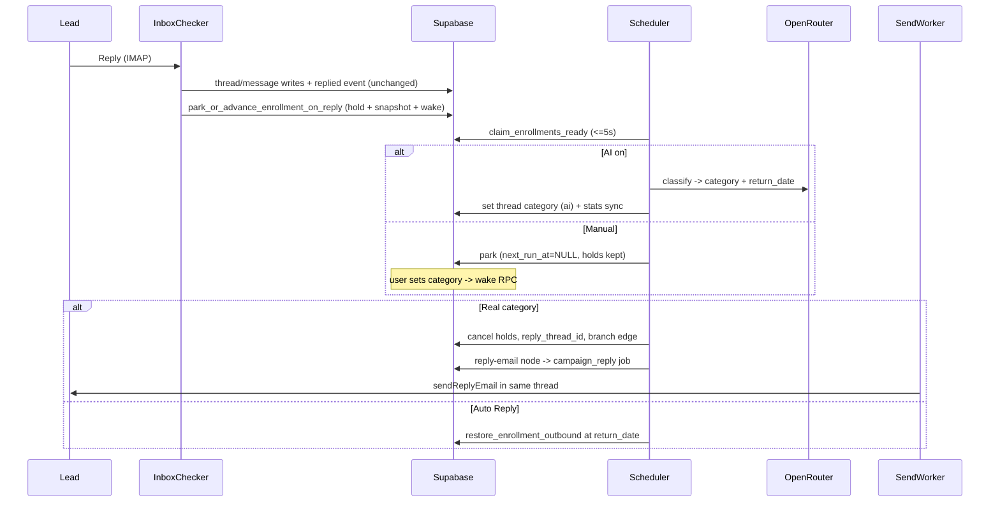
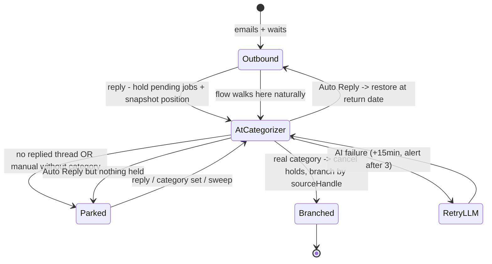

# Categorizer Node — Implementation Spec

**Status**: In implementation
**Replaces**: AI Categorizer placeholder (`workers/scheduler-worker/src/node-handlers/ai-categorizer-handler.ts`)

## Summary

The "AI Categorizer" placeholder becomes the **Categorizer** node:

- Fixed three branch outputs: **Interested / Neutral / Not Interested**. No custom categories.
- Two modes per node: **AI** (cheap LLM via OpenRouter) or **manual** (user categorizes the thread in the Master Inbox).
- Triggered by **any reply** on any of the enrollment's threads. The remaining outbound sequence is put on **hold** (not cancelled) until the category resolves.
- New first-class **Auto Reply** category (OOO/autoresponders). Auto Reply never branches — it **restores** the held outbound sequence, timed to a return date extracted from the OOO text when AI is on.
- Post-categorizer email nodes can send **in-thread replies** (`send_mode: 'reply'`): the replied thread's mailbox, `In-Reply-To`/`References` headers, automatic `Re:` subject, no interval pacing, priority send lane.

## Decisions of record

| Decision | Choice |
| --- | --- |
| Display name | "Categorizer"; internal `node_type` stays `aiCategorizer` (no data migration) |
| Categories | Fixed three branch outputs + non-branching `Auto Reply` |
| AI model | `OPENROUTER_CATEGORIZER_MODEL`, default `google/gemini-2.5-flash-lite`, temperature 0 |
| AI write path | `email_threads.category`, `category_source='ai'`, same stats sync as manual |
| No reply | Park indefinitely: `state='active'`, `next_run_at=NULL` (invisible to claim loop) |
| Reply mid-sequence | Hold pending jobs + snapshot position; fast-forward to categorizer |
| Auto Reply | Restore held jobs/position; resume at extracted return date or now |
| Manual mode | Park with holds kept; Master Inbox category decides (real → branch, Auto Reply → restore) |
| Post-categorizer email | Per-node `send_mode` toggle, default `'reply'` when flow has a categorizer |
| Reply-mode mailbox down | Park with 6h retry; never send from another mailbox |
| AI gating | Info box in node modal (accuracy disclaimer); Preview modal against real replies |
| Validation | Max one Categorizer per flow; reply-mode email requires a Categorizer |

## Architecture

### Event-driven, zero new polling

Parked enrollments have `next_run_at = NULL`, which `claim_enrollments_ready` never selects
(`WHERE next_run_at <= NOW()`). Wakes:

1. **Reply detected** — inbox-checker calls `park_or_advance_enrollment_on_reply` (hold + fast-forward + `next_run_at=NOW()`).
2. **Manual category set** — `updateThreadCategory` calls `wake_enrollment_for_thread_category`.
3. **Safety sweep** — `sweep_parked_categorizer_enrollments` every 30 min from the scheduler (single indexed query; skips `Auto Reply` threads to prevent LLM loops).

### Enrollment lifecycle

## Schema

Migration `supabase/migrations/<ts>_categorizer_hold_restore.sql`:

- `enrollments.reply_thread_id uuid NULL` — set once at branch; idempotency marker and the thread for downstream reply emails.
- `enrollments.held_node_id uuid NULL`, `enrollments.held_next_run_at timestamptz NULL` — outbound snapshot; `held_node_id IS NOT NULL` means restorable.
- Partial index on parked enrollments (`state='active' AND next_run_at IS NULL AND deleted_at IS NULL`).
- `message_jobs.status` CHECK gains `'held'`. Held jobs are invisible to all claim RPCs (`status='pending'` filters).
- `message_jobs.message_type` CHECK gains `'campaign_reply'`; pending-manual partial index and `claim_manual_message_jobs_ready` include it.
- "Auto Reply" needs no schema change: `email_threads.category` is TEXT; `category_source` already allows `'system'`.

### RPCs

| RPC | Caller | Behavior |
| --- | --- | --- |
| `park_or_advance_enrollment_on_reply(enrollment, thread)` | inbox-checker | Eligible = active + `reply_thread_id IS NULL` + flow has live categorizer. If not at categorizer: hold pending campaign jobs, snapshot held columns, `current_node_id`=categorizer. Always wake (`next_run_at=NOW()`). Idempotent. |
| `restore_enrollment_outbound(enrollment, resume_at)` | scheduler | No-op unless `held_node_id` set. Held→pending with `scheduled_at=GREATEST(scheduled_at, resume_at, NOW())`; position restored; `next_run_at=GREATEST(held_next_run_at, resume_at, NOW())`; held columns cleared. |
| `cancel_held_jobs_for_enrollment(enrollment)` | scheduler (branch) | Held→cancelled, held columns cleared. |
| `wake_enrollment_for_thread_category(thread)` | inbox UI / API | Wakes a parked-at-categorizer enrollment. |
| `sweep_parked_categorizer_enrollments(batch)` | scheduler timer | Wakes parked enrollments whose latest replied thread is uncategorized or branchable; skips `Auto Reply`. |

**Held-job hygiene**: every terminal path (bounce/unsubscribe/error stops, campaign-wide cancel/pause/stop, lead removal) also cancels `held` jobs. A stopped enrollment never leaves restorable holds.

## Inbox-checker

`thread-manager.ts` `handleReply`, `isReplyToOriginal` block. Replied event + stats + webhook unchanged. The hard stop becomes:

1. Unsubscribe → existing block + hard stop (precedence).
2. Auto-reply detector (`message-processor.ts`: `Auto-Submitted` != `no`, `X-Autoreply`, `X-Autorespond`, `Precedence: auto_reply`) → stamp `category='Auto Reply'`, `category_source='system'` (never overwrite user-set). Still triggers the park RPC — the handler restores.
3. Real inbound clears machine-set `Auto Reply` (`category_source IN ('system','ai')` → NULL) so it gets re-classified.
4. Flow has categorizer + not yet categorized → `park_or_advance_enrollment_on_reply` (no stop).
5. Otherwise → existing stop `stopped_reason='replied'`.

## Scheduler

### Flow evaluation

Current node is `aiCategorizer` + `reply_thread_id IS NULL` → return `{ nodes: [currentNode] }` (re-run handler; deferred-email precedent). After branch, `current_node_id` already points at the target node, so normal edge-following applies.

### Categorizer handler

1. Latest replied thread (`DISTINCT ON` by `last_message_at`). None → park.
2. Category in the three → branch (6).
3. Category `Auto Reply` → restore. Nothing held → park, NO LLM call. Holds present: AI on → resolve return date; resume_at = date or NOW; AI off → NOW.
4. AI on + uncategorized → classify (four classes + `return_date`); write category (`ai`) + stats sync. Auto Reply → 3; else branch. Failure → `next_run_at +15min`, Slack alert after 3 consecutive failures.
5. Manual + uncategorized → park (holds kept).
6. Branch: cancel holds, set `reply_thread_id`, edge by `sourceHandle` (`interested` | `neutral` | `not-interested`), advance with `next_run_at=NOW()`. No edge for category → enrollment `completed`.

### Classify module

`workers/scheduler-worker/src/categorizer/classify.ts` — OpenRouter, temperature 0, JSON
`{ "category": "...", "return_date": "YYYY-MM-DD" | null }`. Prompt: OOO/autoresponders are `Auto Reply`; extract explicit return dates (message date provided for relative phrases). `return_date` must be future and <= 90 days, else null. Canonical prompt/contract lives in `lib/categorizer/` (preview endpoint); the worker module mirrors it (workers do not import `lib/`). LLM transport is injectable for tests.

### Versioning

Bump `CATEGORIZER_PROMPT_VERSION` in `lib/inbox/smartHandlingVersion.ts`
whenever the categorizer prompt, parser, or model contract changes in either
`lib/categorizer/` or the worker mirror. New classifications stamp that version
into `handling_metadata.suggestion_version`, which lets feedback analysis ignore
older logic generations.

Operational analysis workflow:
`docs/implementation/inbox-ui/SMART_HANDLING_FEEDBACK.md`

### Sweep timer

30-min `startSingleFlightInterval` in `worker.ts` (OOO-resume shape).

## Reply-mode email node

- Node data `send_mode: 'new' | 'reply'` (absent = `'new'`). Builder defaults to `'reply'` when the flow contains a Categorizer at node creation.
- `handleReplyEmailNode` (scheduler): requires `reply_thread_id` (NULL -> stop with `stopped_reason='error'`). Builds a `campaign_reply` job like `create_inbox_reply_job`: thread's mailbox, `In-Reply-To` = latest inbound `message_id`, `References` = full chain, subject `Re: <thread subject>`, body from the node's variant pipeline, `node_id` set, `interval_id` NULL, `scheduled_at` = NOW clamped to campaign schedule (no jitter/interval).
- Mailbox disconnected/paused/deleted → no job, `next_run_at +6h`, never another mailbox.
- Send worker: `campaign_reply` is claimed in the manual-priority lane, routed through the campaign send pipeline with reply threading, and still honors mailbox throttles.
- Daily mailbox cap does **not** delay `campaign_reply`; reply-mode sends share the same daily accounting as manual inbox replies, but only dedicated `campaign` sends wait until tomorrow when the daily limit is exhausted.
- Throttle retries stay on the same `campaign_reply` row (reply-lane semantics) instead of falling back to campaign deferred/recreate behavior. Hourly and min-gap retries still clamp `scheduled_at` to the next allowed campaign send window, so reply-mode sends respect both the mailbox throttle floor and the campaign schedule.
- After SMTP success, the send worker performs an idempotent thread write: it ensures an `email_messages` row exists for the sent `campaign_reply`, relinks an existing row by `message_id` if needed, and repairs `email_threads.message_count`, `last_message_at`, and `participants` from the observed thread rows before bumping the enrollment.

## Inbox / UI

- `updateThreadCategory` additionally calls `wake_enrollment_for_thread_category`. Setting `Auto Reply` manually on a held enrollment resumes outbound (surfaced in UI copy).
- Mark-OOO modal's "resume sequence" option hidden unless enrollment is `stopped + replied`.
- "Auto Reply" added to preset category lists (inbox set-category menu, inbox filter, campaign lead filters) and category type unions. `is_positive` math unchanged (only `Interested`).
- Lead-page reply-category RPCs unchanged: `Auto Reply` reads as uncategorized there.

## Builder

- Metadata label "Categorizer"; node renders three fixed source handles (`interested`/`neutral`/`not-interested`).
- Modal: label, `use_ai` toggle (default off), AI info box, Preview button. Node data `{ label, use_ai }`.
- Save validation: max one Categorizer; reply-mode emails require a Categorizer.
- `CategorizerPreviewModal`: campaign's replied threads + predicted (AI, via `categorizerPreview` Amplify function) or current (manual) categories. Read-only.

## Slack alerting

- **Critical**: park RPC failure (reply failed to halt outbound), restore failure (stranded holds), branch-time failure (double-process/leak risk).
- **Warning**: LLM failures after 3 consecutive (aggregated per campaign), stats-sync failure post-classification, reply-email mailbox unavailable (first occurrence, aggregated), `reply_thread_id NULL` at reply node, edge mismatch, sweep timer `onError`.
- **Warning**: `campaign_reply` post-send thread persistence failure (email already sent, Master Inbox row may need repair).
- **Audit**: self-recovery additions — orphaned holds (held jobs on dead enrollments) and stale parks (branchable category unprocessed > 24h).

Client-side failures stay console-only; the sweep covers a lost manual wake within 30 minutes.

## Caveats

- Header detection + AI catch most autoresponders; headerless ones in manual mode need a human, and AI misclassification cuts both ways (disclosed in the modal info box).
- Return-date extraction is best-effort and bounded (future, <=90 days); ambiguity → resume now. AI off never extracts dates.
- Restore is position-faithful, not time-faithful: hold time counts toward elapsed waits.
- Only `pending` jobs can be held; an in-flight (`reserved`/`sending`) email may still go out.
- Parked enrollments read as `active` indefinitely (no distinct UI state in v1).
- Recategorization after branch updates stats but never re-routes.
- Old freeform-category draft nodes must be re-connected to the new fixed handles.
- Auto-replies still count in `replied_count` (event recorded before classification).
- Already-sent prod rows that predate the durable thread-write fix can be repaired with `scripts/repair-campaign-reply-inbox-rows.ts`.

## Test strategy

See plan section "Testing strategy — production-gate quality": `categorizerRegressionOutcomes.test.ts` (old campaigns bit-identical, `held` inert across all RPCs), `categorizerOutcomes.test.ts` (seven full campaign runs), failure-mode matrix (LLM, races, mailbox hazards, terminal hygiene, duplicate-send guards), `categorizerSweepOutcomes.test.ts`, colocated units, and the `scripts/seed/scenarios/categorizer-flow/` pre-prod gate.

## Deployment

Per `.cursor/rules/deployment-workers.mdc`: `npm run apply:migrations` → `npm run build:dev` (scheduler, send, inbox-checker) → `npm run restart:dev`. Scheduler env: `OPENROUTER_API_KEY`, `OPENROUTER_CATEGORIZER_MODEL`. Rollout safety: migrations additive/inert; inbox-checker behavior changes only when a flow contains a categorizer node; builder UI ships last.
