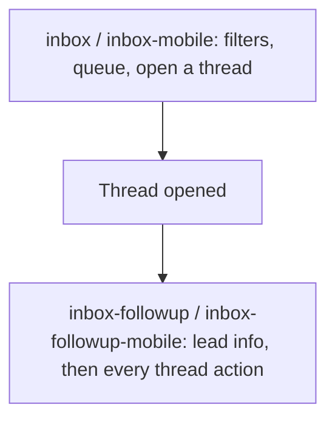

# Onboarding flow authoring

How to author onboarding flows and wire the screen anchors/triggers they need. Infrastructure (engine, provider, resolver, persistence, overlay/modal-host rendering) is already built; this doc covers what you need to write flows that work and stay correct as the app grows.

---

## Runtime model

1. A screen calls `useOnboardingTrigger('<flowId>', { when: ready })` once its UI is ready. This registers a flow intent with the provider; unregister happens automatically on unmount.
2. When the engine is idle, the provider **scheduler** picks the first unseen flow in registry order that is either `autoStart` (only `welcome`) or registered ready by a mounted screen. A single settle delay runs before start; guard failures retry when conditions change (no silent drops).
3. `resolveFlow(def, { segment, role })` runs **before** the engine starts:
   - Picks segment copy (`self_serve` vs `dfy`).
   - Drops steps whose `requiresRole` excludes the current user.
4. The engine runs concrete steps. Overlays render plain strings — no segment/role logic in UI components.
5. Terminal outcomes: `completed`, `dismissed` (user skipped), or `aborted` (spotlight target never appeared). The engine returns to idle atomically; the provider persists the outcome, then the scheduler picks the next eligible flow.

**Segment** (account-level):
```
segment = account.onboarding_segment
       ?? (billing.agreement_type === 'managed_services_agreement' ? 'dfy' : 'self_serve')
```

**Role** (membership-level, affects which steps appear): `owner | admin | member` via `getAccountMembershipRole`.

Most flows only vary **copy** by segment (`SegmentCopy`) — same steps, different wording. A flow's `FLOWS` registry entry can instead be a per-segment map of distinct `OnboardingFlowDef`s (`{ self_serve: ..., dfy: ... }`) when the *content*, not just the wording, needs to diverge — including omitting a segment key entirely so that segment never sees the flow. See `getFlow`/`getAllFlows` in `lib/onboarding/flows/index.ts`.

---

## Framework rules: TargetId, hostId, and surface

Three concepts, kept deliberately separate so the same anchor can be reused safely across platforms and modal surfaces:

| Concept | Meaning | Where it lives |
|---|---|---|
| **TargetId** | What the lesson is about (semantic anchor) — e.g. `inboxActionClose` | `TARGETS` in `lib/onboarding/types.ts`; referenced by `targetId` on a step |
| **hostId** | Where the cutout renders: `undefined` = the app-root viewport, or a named modal host | `hostId?: OnboardingHostId` on a `SpotlightStepDef`/`SpotlightStep` |
| **Surface** | The physical ref backing a target on a specific render location (`'global'` or a host id) | `useOnboardingTarget(id, { surface })`; keyed in the registry by `(surface, targetId)` |

**Never infer surface from `targetId` alone.** The same semantic target can live in a modal for one flow/platform and on the plain screen for another — for example, the inbox action tour highlights `inboxActionClose` inline in the desktop toolbar (`hostId` unset, global viewport) but inside a bottom sheet on mobile (`hostId: 'inboxMessageActions'`). Routing must be **flow-authored** via `hostId` on the step, not derived from the target.

`resolveSpotlightSurface(step, blockingOverlayPresent)` in `lib/onboarding/onboardingHosts.ts` is the single routing decision: a step with `hostId` set always renders in its host (regardless of any unrelated blocking modal); a step without `hostId` renders in the global viewport overlay unless something else is blocking.

### Modal hosts

A modal host is a surface (bottom sheet, panel) that can render an onboarding spotlight **inside itself** instead of the app-root overlay. Today there is one: `inboxMessageActions` (the mobile message-actions sheet).

To add a new one:

1. Add the id to `OnboardingHostId` in `lib/onboarding/onboardingHosts.ts`.
2. Set `hostId` on the spotlight steps that render inside that modal.
3. Wrap the modal body in `<OnboardingHost hostId={...} active={visible}>`.
4. Add a screen-level lifecycle hook call — `useOnboardingHostLifecycle({ hostId, isOpen, open, close, openTriggerTargetId })` — so the modal auto-opens while its steps are active and closes when they finish. Pass `enabled` as a secondary guard (e.g. a platform check) if the modal only makes sense on some surfaces; the step's `hostId` is always the primary signal.
5. Register the in-modal refs with `useOnboardingTarget(id, { surface: hostId })` so they never collide with a same-id ref registered elsewhere with `surface: 'global'` (the default).

### Surface-scoped target registry

`registerTarget` / `measureTarget` / `getTargetNode` all accept an optional `surface` and key the ref by `(surface, targetId)` (see `lib/onboarding/targetRegistry.ts`). `useOnboardingTarget(id, { surface })` is the component-facing wrapper — pass `surface` only when the same `targetId` also exists on another surface; otherwise the default (`'global'`) is correct and you can keep calling `useOnboardingTarget(TARGETS.x)` or `useOnboardingTarget(TARGETS.x, enabled)` as before.

Measurement defaults its surface to the **active step's** `hostId` (falling back to `'global'`) when no explicit surface is passed, so `SpotlightOverlay` and `useSpotlightMeasurement` never need to know about surfaces at all — they just measure "the current step's target" and the registry resolves the right ref.

---

## Currently registered flows

| Flow id | Trigger | Notes |
|---|---|---|
| `welcome` | **autoStart** on first login (only flow that auto-starts) | Nav orientation, one line per item, ends by routing to `/account`. Segment-aware copy. |
| `inbox` | First visit to inbox on desktop | Mandatory basics: filters, queue, open indicator, open a thread. `mandatoryUnlessSeen: 'inbox-mobile'`. |
| `inbox-mobile` | First visit to inbox on mobile | Same basics content, mobile placement. `mandatoryUnlessSeen: 'inbox'`. |
| `inbox-followup` | Desktop, after basics, once a thread is open | Optional: lead info, toolbar intro, then every thread action (close, block, OOO, replace, tags, category) inline or via the overflow menu. |
| `inbox-followup-mobile` | Mobile, after basics, once a thread is open | Same lessons; opens the actions sheet, then walks each row inside it. |
| `account` | First visit `/account` | **Role-gated**: owner/admin get team, billing, API/webhooks; members get profile + notifications only. |

Each flow fires **once per user**, then never again unless replayed (`resetFlow`/`resetAllFlows`) or its `version` bumps with `reshowOnVersionBump: true`.

### The inbox platform split

Inbox onboarding is split by platform rather than by data milestone: `inbox`/`inbox-mobile` are a **mandatory** basics tour (only one platform's needs to be completed — see `mandatoryUnlessSeen`), and `inbox-followup`/`inbox-followup-mobile` are a single **optional** follow-up tour registered once a thread is open. The desktop and mobile pair in each layer share the same lesson copy and `TargetId`s; what differs is `hostId` (mobile's sheet-row steps declare it, desktop's inline/overflow steps never do), `advance` mode, and the toolbar-vs-sheet wiring described below.



---

## File layout

```
lib/onboarding/
  types.ts              # TARGETS, FlowId, step/flow types (authoring + resolved)
  onboardingHosts.ts     # OnboardingHostId, resolveSpotlightSurface
  targetRegistry.ts      # TargetSurface, targetKey, resolveTargetSurface
  resolveFlow.ts          # segment/role resolution
  scheduler.ts            # pickNextFlow, canStartFlow
  flows/
    welcome.ts
    inbox.ts
    inbox-mobile.ts
    inbox-followup.ts
    inbox-followup-mobile.ts
    inbox-toolbar.ts      # desktop overflow-aware step expansion
    account.ts
    _template.ts          # reference shape (not registered)
    index.ts               # FLOWS registry — register each flow here
```

Register in `index.ts`:

```ts
import { welcomeFlow } from './welcome';
import { inboxFlow } from './inbox';
// ...

export const FLOWS: Partial<Record<FlowId, FlowRegistryEntry>> = {
  welcome: welcomeFlow,   // same def for every segment
  inbox: inboxFlow,
  // ...
};
```

`Partial<Record<FlowId, …>>` — not every planned id must exist yet. Each value is a `FlowRegistryEntry`: either a single `OnboardingFlowDef` (shared across segments, copy varies via `SegmentCopy`) or a `Partial<Record<Segment, OnboardingFlowDef>>` when whole steps need to differ, or a segment should see no flow at all for that id.

---

## Authoring shape (`OnboardingFlowDef`)

See `lib/onboarding/flows/_template.ts` for the canonical example.

```ts
export const welcomeFlow: OnboardingFlowDef = {
  id: 'welcome',
  version: 1,
  autoStart: true,              // ONLY welcome uses this
  reshowOnVersionBump: false,   // opt-in; default false
  mandatory: false,             // opt-in; blocks skip/dismiss until seen or aborted
  mandatoryUnlessSeen: undefined, // downgrade mandatory once a sibling flow is seen
  steps: [ /* ... */ ],
};
```

### Step kinds

**Announcement** — full-screen modal with optional illustration:

```ts
{
  kind: 'announcement',
  route?: string,           // provider navigates here before showing step
  title?: SegmentCopy,
  description?: SegmentCopy,
  render: () => ReactNode,  // lazy-require heavy art here (see Pitfalls)
  maxWidth?: '4xl' | '5xl' | '6xl',
  requiresRole?: Role[],
}
```

**Spotlight** — highlights a registered anchor:

```ts
{
  kind: 'spotlight',
  targetId: TargetId,       // must match TARGETS registry
  hostId?: OnboardingHostId, // set only if the target renders inside a modal host
  route?: string,
  title: SegmentCopy,
  body: SegmentCopy,
  placement?: 'top' | 'bottom' | 'left' | 'right',
  advance?: 'manual' | 'onTargetPress' | 'onRequirementMet',  // default 'manual'
  nextGate?: { dwellMs?: number; waitForSignal?: boolean },
  skipIfTargetMissing?: boolean,
  requiresRole?: Role[],
}
```

- **`manual`**: user clicks Next in the callout.
- **`onTargetPress`**: step completes when the user presses the highlighted element (cutout stays interactive).
- **`onRequirementMet`**: Next is hidden until the screen calls `notifyStepRequirementMet()`.

Keep flows **short** (2–5 steps for basics; longer is fine for an exhaustive action walk like `inbox-followup`, but each step should demonstrate exactly one control).

---

## Segment copy (`SegmentCopy`)

Copy can be a plain string (same for all segments) or segment-aware:

```ts
title: {
  default: 'Your campaigns',
  dfy: 'Furnace builds & runs these for you',
}
```

At runtime: `copy[segment] ?? copy.default`.

**Framing guidance:**
- **Self-serve**: action-oriented ("Connect senders", "Create a campaign").
- **DFY**: observational ("Furnace manages these", "Your results live here", "Reply to leads here"). Don't instruct them to configure things Furnace handles.

For most flows, segment changes **copy only**. When DFY genuinely has nothing to learn about a screen, don't force a `SegmentCopy` variant onto a step they shouldn't see at all — fork the registry entry instead (see "File layout" above) so the flow doesn't exist for that segment.

---

## Role gating (`requiresRole`)

Use on steps that only make sense for certain roles. Filtered at resolve time — progress dots reflect the filtered count.

```ts
{
  kind: 'spotlight',
  targetId: TARGETS.accountTeam,
  title: 'Invite your team',
  body: 'Add teammates and manage access.',
  requiresRole: ['owner', 'admin'],
}
```

**`account` flow pattern:**
- **owner/admin**: profile, notifications, team, billing, API keys/webhooks.
- **member**: profile, notifications only.

If all steps filter out for a role, the flow completes immediately (trivially seen).

---

## Anchor registry (`TARGETS`)

Defined in `lib/onboarding/types.ts`. Use these ids in steps; wire matching refs on screens with `useOnboardingTarget(TARGETS.x)`.

| Target id | Intended screen / element |
|---|---|
| `navCampaigns`, `navMetrics`, `navInbox`, `navLeads`, `navSenders`, `navSettings` | Per-item NavBar **and** BottomNavBar buttons (`navItems` is deprecated — kept for the authoring template) |
| `inboxThreadList` | Inbox thread list chrome |
| `inboxOpenThread` | A thread row in the list (basics: "tap to continue") |
| `inboxOpenIndicator` | The open/unread dot on a thread row |
| `inboxCategories` | Inbox filter/categories control |
| `inboxMessagePane` | Inbox message pane (always mounted; shows skeleton/empty/thread) |
| `inboxLeadDetail` | Prospect name/email block that opens the lead profile — global on both platforms |
| `inboxThreadActions` | Desktop message header's right-side toolbar cluster |
| `inboxMobileActions` | Mobile "open actions" trigger — the step that opens the sheet |
| `inboxSheetActions` | Coarse anchor wrapping the whole sheet actions block (mobile) |
| `inboxActionClose`, `inboxActionBlock`, `inboxActionOutOfOffice`, `inboxActionReplace`, `inboxActionTags`, `inboxActionCategory` | Per-action controls — desktop toolbar/header (`surface: 'global'`) or mobile sheet row (`surface: 'inboxMessageActions'`, `hostId` set on the mobile steps) |
| `inboxAction*OverflowTrigger` | Desktop-only: the overflow menu item that stands in for a collapsed action while its tour step pins the menu open |
| `accountProfile` | Account profile section |
| `accountNotifications` | Account notifications section |
| `accountTeam` | Account team management section |
| `accountIntegrations` | Account API keys section |
| `accountWebhooks` | Account webhooks section (distinct from `accountIntegrations` — don't conflate) |

### Empty-state anchoring rule (critical)

Anchor **chrome that exists with no data** — never data rows.

Good: filter bar, categories rail, page header, compose button, nav items.
Bad: first inbox thread row, first lead row, a chart that only renders after data loads.

Gate a **basics/intro** flow on **screen-ready, not data-present**:

```ts
useOnboardingTrigger('inbox', { when: !initialLoading });
// NOT: { when: threads.length > 0 }
```

A brand-new empty account must still get the intro tour immediately. A follow-up/detail flow that depends on a real object existing (like `inbox-followup`, gated on a thread being open) is the deliberate exception — gate its `when` on that milestone once the underlying fetch has settled, so the check isn't racing a still-loading `0`.

---

## Screen wiring (paired with each flow)

Every flow needs **both**:

1. **Anchors** — `useOnboardingTarget(TARGETS.x)` on the relevant `View`. Pass `{ surface }` only when the same id also exists on another render surface.
2. **Trigger** — `useOnboardingTrigger('<flowId>', { when })` on the screen.

Screens to wire:

| Flow | Screen file(s) |
|---|---|
| `welcome` | autoStart only; nav anchor on NavBar + BottomNavBar |
| `inbox` / `inbox-mobile` / `inbox-followup` / `inbox-followup-mobile` | `components/inbox/InboxScreen.tsx` (all four triggers live here) |
| `account` | `app/(main)/account.tsx` |

Nav anchor goes on **both** `components/ui/layout/NavBar.tsx` and `components/ui/layout/BottomNavBar.tsx` so welcome works on web and mobile.

Import from `@/components/onboarding`:

```ts
import { useOnboardingTarget, useOnboardingTrigger } from '@/components/onboarding';
import { TARGETS } from '@/lib/onboarding/types';
```

Hooks are safe no-ops outside `OnboardingProvider`.

---

## Step ordering and routes

- Put **`route`** on a step when its anchor lives on a different path than the current screen. The provider navigates there before showing the step.
- Order steps so each `targetId` is on-screen (or navigated to, or the modal host is open) when the step runs.
- For desktop toolbar tours whose actions may collapse into an overflow menu, author only the real lessons with `toolbarActionKey` set (see `inbox-followup.ts`); `buildInboxToolbarFlow` in `lib/onboarding/flows/inbox-toolbar.ts` inserts a single generic "More actions live here" opener ahead of the first overflowed action at resolve time — don't author that step by hand.

---

## Versioning and replay

- Bump `version` when flow content changes materially (including a routing/behavior fix like a `hostId` correction, even if the copy is unchanged).
- Set `reshowOnVersionBump: true` only if users who already saw an older version should see it again (opt-in, rare — used by `welcome`, `inbox`, `inbox-mobile`, `account`).
- Flows are replayable during QA by deleting `user_onboarding_state` rows, or via `resetFlow`/`resetAllFlows`.

---

## Pitfalls to avoid

1. **Don't use `autoStart` on feature flows** — only `welcome`.
2. **Don't anchor data rows** — empty accounts must still get the intro tour.
3. **Don't gate a basics/intro flow's `when` on data presence** — gate on `!initialLoading` / shell ready.
4. **Don't infer a step's render surface from its `targetId`** — set `hostId` explicitly on the step when it renders inside a modal host; never add an entry to a target→host map (there isn't one — this is exactly the bug this pattern replaced).
5. **Don't rely on registration order to avoid ref collisions** — if the same `targetId` is registered on two different surfaces (e.g. a desktop toolbar button and a mobile sheet row), pass `surface` on both `useOnboardingTarget` calls.
6. **Don't put segment/role logic in copy at render time** — use `SegmentCopy` / `requiresRole`; the resolver handles it.
7. **Don't reference target ids not in `TARGETS`** — compile error by design.
8. **Don't eagerly import heavy illustrations at module scope** — `render: () => createElement(require('...').Thing)` keeps `require`-ing the art lazy so importing the flow registry (including in tests) never pulls in a react-native/SVG chain.
9. **Keep DFY copy passive** — they're checking stats and replying, not configuring infrastructure.
10. **Keep copy blatant, not advisory** — name what a thing is/does; don't editorialize or coach. Save advisory framing for DFY's "Furnace handles this" voice only.
11. **Welcome dismissal does not suppress feature tours** — each flow is independently seen.

---

## QA checklist per flow

- [ ] Registered in `lib/onboarding/flows/index.ts`
- [ ] All `targetId`s wired on screen with `useOnboardingTarget`, with `surface` set on any id that exists on more than one surface
- [ ] Any step that renders inside a modal host declares `hostId`; the owning screen has a lifecycle hook (`useOnboardingHostLifecycle`) for that host
- [ ] Screen has `useOnboardingTrigger` with appropriate `when`
- [ ] Works on **empty account** (no data) — basics fires, follow-up/detail does not
- [ ] DFY copy reads naturally for a managed-services client
- [ ] Self-serve copy reads naturally for a platform-agreement client
- [ ] Role-gated flow: a lower-privilege role sees fewer steps than owner/admin
- [ ] Flow completes without abort on a normally-loaded screen (targets appear within the retry window)
- [ ] If two platforms share lesson copy (like the inbox tours), verify each platform's steps render on their own surface only — no cross-platform modal ever opens

---

## Key paths

| What | Where |
|---|---|
| Types + `TARGETS` + `FlowId` | `lib/onboarding/types.ts` |
| Modal host ids + spotlight surface routing | `lib/onboarding/onboardingHosts.ts` |
| Surface-scoped target registry keys | `lib/onboarding/targetRegistry.ts` |
| Authoring template | `lib/onboarding/flows/_template.ts` |
| Flow registry | `lib/onboarding/flows/index.ts` |
| Resolver (copy + role filter) | `lib/onboarding/resolveFlow.ts` |
| Screen trigger hook | `components/onboarding/useOnboardingTrigger.ts` |
| Anchor hook | `components/onboarding/useOnboardingTarget.ts` |
| Modal host wrapper + lifecycle hook | `components/onboarding/OnboardingHost.tsx`, `components/onboarding/useOnboardingHostLifecycle.ts` |
| Scheduler (`pickNextFlow`, `canStartFlow`) | `lib/onboarding/scheduler.ts` |
| Provider (registry + scheduler) | `components/onboarding/OnboardingProvider.tsx` |
