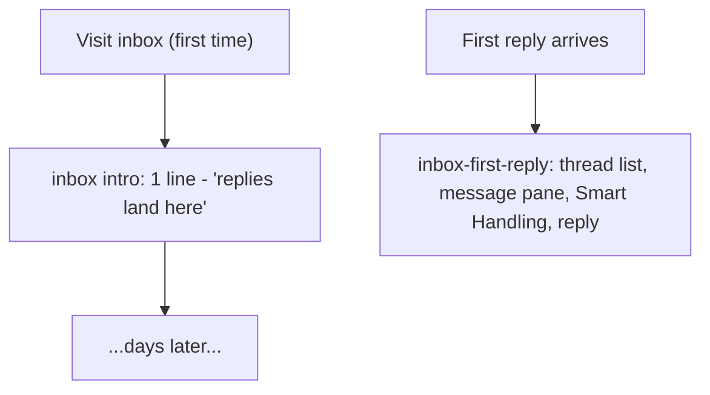

# Onboarding flow authoring handoff

Handoff for an agent whose job is to **author draft onboarding flows** and wire screen anchors/triggers. Infrastructure (engine, provider, resolver, persistence, overlay hardening) is already built or specified; this doc covers only what you need to write flows that work.

---

## Runtime model (what your flows plug into)

1. A screen calls `useOnboardingTrigger('<flowId>', { when: ready })` once its UI is ready. This registers a flow intent with the provider; unregister happens automatically on unmount.
2. When the engine is idle, the provider **scheduler** picks the first unseen flow in registry order that is either `autoStart` (only `welcome`) or registered ready by a mounted screen. A single settle delay runs before start; guard failures retry when conditions change (no silent drops).
3. `resolveFlow(def, { segment, role })` runs **before** the engine starts:
   - Picks segment copy (`self_serve` vs `dfy`).
   - Drops steps whose `requiresRole` excludes the current user.
4. The engine runs concrete steps. Overlays render plain strings — no segment/role logic in UI components.
5. Terminal outcomes: `completed`, `dismissed` (user skipped), or `aborted` (spotlight target never appeared). The engine returns to idle atomically; the provider persists the outcome, then the scheduler picks the next eligible flow (e.g. welcome → account when the account screen registers ready).

### Layered flows: intro + detail

Several screens are **layered** rather than a single tour: a brief **intro** flow (the original flow id) fires on first visit regardless of data state, and a separate **detail** flow (a new, distinct flow id) fires later — the first time the relevant thing actually appears (first reply, first campaign, first mailbox, etc). This replaces trying to write one flow that reads well both empty and populated.



Each screen calls `useOnboardingTrigger` **twice** — once per layer — with the detail call's `when` gated on the milestone:

```ts
useOnboardingTrigger('inbox', { when: shellReady });
useOnboardingTrigger('inbox-first-reply', { when: shellReady && initialThreadsLoadSettled && threads.length > 0 });
```

Single-flight + per-id `seen` + registry-order scheduling already handle ordering: intro fires first (it appears before its detail pair in `ALL_FLOWS`), detail fires whenever its milestone is first true — could be the same session or weeks later. Write intro copy as pure orientation ("this is X, here's the one thing to do"); push all depth, terminology, and non-obvious controls into the detail flow, since by then there's something real behind it.

Current layered pairs: `inbox` / `inbox-first-reply`, `metrics` / `metrics-activity`, `campaigns` / `campaigns-detail`, `leads` / `leads-detail`, `senders` / `senders-detail`, `mission-control` / `mission-control-running`. `welcome`, `account`, `builder`, and `notifications` are single flows (their anchors are chrome, not data, so there's nothing to gate on).

**Segment** (account-level):
```
segment = account.onboarding_segment
       ?? (billing.agreement_type === 'managed_services_agreement' ? 'dfy' : 'self_serve')
```

**Role** (membership-level, affects which steps appear): `owner | admin | member` via `getAccountMembershipRole`.

Most flows only vary **copy** by segment (`SegmentCopy`) — same steps, different wording. A flow's `FLOWS` registry entry can instead be a per-segment map of distinct `OnboardingFlowDef`s (`{ self_serve: ..., dfy: ... }`) when the *content*, not just the wording, needs to diverge — including omitting a segment key entirely so that segment never sees the flow. See `getFlow`/`getAllFlows` in `lib/onboarding/flows/index.ts`.

**The campaign-building journey is the one place this is used today.** Furnace's team builds, edits, and launches campaigns for DFY clients, so DFY gets a single "your programs show up here" spotlight on the campaigns list and nothing else — `campaigns-detail`, `builder`, `mission-control`, and `mission-control-running` have no `dfy` entry and simply never fire for that segment. Self-serve clients manage all of this themselves, so they get the full depth: campaigns list → row detail → builder → mission control, each with a multi-step tour.

---

## Flow library to author

| Flow id | Trigger | Notes |
|---|---|---|
| `welcome` | **autoStart** on first login (only flow that auto-starts) | Nav orientation, one line per item, ends by routing to `/account`. Segment-aware copy. |
| `inbox` | First visit `/inbox` | 1-step intro: "replies land here". |
| `inbox-first-reply` | First visit `/inbox` **and** `threads.length > 0` | Detail: thread list, categories, message pane, Smart Handling, reply. |
| `metrics` | First visit `/metrics` | Intro: date range + what the dashboard is. |
| `metrics-activity` | First visit `/metrics` **and** `metrics.totalSent > 0` | Detail: what each headline number means, daily chart. No coaching. |
| `leads` | First visit `/leads` | Intro: "your lead data lives here". |
| `leads-detail` | First visit `/leads` **and** `totalCount > 0` | Detail: search/filter, export/save list, bulk select. |
| `account` | First visit `/account` | **Role-gated**: owner/admin get team, billing, API/webhooks; members get profile + notifications only. |
| `notifications` | First visit `/notifications` | Brief: activity feed + status filter. |
| `senders` | First visit `/senders` | Intro: "campaigns send from mailboxes here". |
| `senders-detail` | First visit `/senders` **and** `mailboxes.length > 0` | Detail: search/filter, connection health, daily limits. |
| `campaigns` | First visit `/campaigns` | Intro, segment-forked: self-serve gets "build and manage sequences here"; DFY gets a single "Furnace builds these for you" spotlight — the *only* step DFY sees in this whole journey. |
| `campaigns-detail` | First visit `/campaigns` **and** `campaigns.length > 0` | **Self-serve only** — no `dfy` entry. Detail: search/filter, row stats, row menu. |
| `builder` | First visit `/builder` | **Self-serve only** — no `dfy` entry (Furnace's team edits DFY sequences). Canvas is always seeded; single tour. |
| `mission-control` | First visit `/campaigns/[id]/mission-control` | **Self-serve only** — no `dfy` entry. Intro: flow, schedule, mailboxes, launch checklist (draft-oriented). |
| `mission-control-running` | First visit **and** `campaign.status === 'running'` | **Self-serve only** — no `dfy` entry. Detail: live status card, replies route to Master Inbox. |

Each flow fires **once per user**, then never again unless replayed. See "Layered flows" above for how the intro/detail pairs relate.

---

## File layout

```
lib/onboarding/flows/
  welcome.ts
  inbox.ts
  inbox-first-reply.ts   # detail flow, paired with inbox.ts
  metrics.ts
  metrics-activity.ts    # detail flow, paired with metrics.ts
  ...
  _template.ts      # reference shape (do not need to register)
  index.ts          # FLOWS registry — register each flow here
```

Register in `index.ts`:

```ts
import { welcomeFlow } from './welcome';
import { campaignsFlowSelfServe, campaignsFlowDfy } from './campaigns';
// ...

export const FLOWS: Partial<Record<FlowId, FlowRegistryEntry>> = {
  welcome: welcomeFlow,                // same def for every segment
  campaigns: { self_serve: campaignsFlowSelfServe, dfy: campaignsFlowDfy }, // segment-forked
  // ...
};
```

`Partial<Record<FlowId, …>>` — not every planned id must exist yet. Each value is a `FlowRegistryEntry`: either a single `OnboardingFlowDef` (shared across segments, copy varies via `SegmentCopy`) or a `Partial<Record<Segment, OnboardingFlowDef>>` when whole steps need to differ, or a segment should see no flow at all for that id.

---

## Authoring shape (`OnboardingFlowDef`)

See `lib/onboarding/flows/_template.ts` for the canonical example.

```ts
export const welcomeFlow: OnboardingFlowDef = {
  id: 'welcome',
  version: 1,
  autoStart: true,              // ONLY welcome uses this
  reshowOnVersionBump: false,   // opt-in; default false
  steps: [ /* ... */ ],
};
```

### Step kinds

**Announcement** — full-screen modal with optional illustration:

```ts
{
  kind: 'announcement',
  route?: string,           // provider navigates here before showing step
  title?: SegmentCopy,
  description?: SegmentCopy,
  render: () => ReactNode,  // lazy-import heavy art here
  maxWidth?: '4xl' | '5xl' | '6xl',
  requiresRole?: Role[],
}
```

**Spotlight** — highlights a registered anchor:

```ts
{
  kind: 'spotlight',
  targetId: TargetId,       // must match TARGETS registry
  route?: string,
  title: SegmentCopy,
  body: SegmentCopy,
  placement?: 'top' | 'bottom' | 'left' | 'right',
  advance?: 'manual' | 'onTargetPress',  // default 'manual'
  requiresRole?: Role[],
}
```

- **`manual`**: user clicks Next in the callout.
- **`onTargetPress`**: step completes when the user presses the highlighted element (cutout stays interactive).

Keep flows **short** (2–5 steps). Feature flows are mini-tours, not product manuals.

---

## Segment copy (`SegmentCopy`)

Copy can be a plain string (same for all segments) or segment-aware:

```ts
title: {
  default: 'Your campaigns',
  dfy: 'Furnace builds & runs these for you',
}
```

At runtime: `copy[segment] ?? copy.default`.

**Framing guidance:**
- **Self-serve**: action-oriented ("Connect senders", "Create a campaign").
- **DFY**: observational ("Furnace manages these", "Your results live here", "Reply to leads here"). Don't instruct them to configure things Furnace handles.

For most flows, segment changes **copy only**. When DFY genuinely has nothing to learn about a screen (they don't build it, edit it, or launch it themselves), don't force a `SegmentCopy` variant onto a step they shouldn't see at all — fork the registry entry instead (see "File layout" above) so the flow doesn't exist for that segment.

---

## Role gating (`requiresRole`)

Use on steps that only make sense for certain roles. Filtered at resolve time — progress dots reflect the filtered count.

```ts
{
  kind: 'spotlight',
  targetId: TARGETS.accountTeam,
  title: 'Invite your team',
  body: 'Add teammates and manage access.',
  requiresRole: ['owner', 'admin'],
}
```

**Account flow pattern:**
- **owner/admin**: profile, notifications, team, billing, API keys/webhooks.
- **member**: profile, notifications only.

If all steps filter out for a role, the flow completes immediately (trivially seen).

---

## Anchor registry (`TARGETS`)

Defined in `lib/onboarding/types.ts`. Use these ids in steps; wire matching refs on screens with `useOnboardingTarget(TARGETS.x)`.

| Target id | Intended screen / element |
|---|---|
| `navCampaigns`, `navMetrics`, `navInbox`, `navLeads`, `navSenders`, `navSettings` | Per-item NavBar **and** BottomNavBar buttons (`navItems` is deprecated — kept for tests only) |
| `inboxThreadList` | Inbox thread list chrome (search + list column; always mounted, mobile and desktop) |
| `inboxCategories` | Inbox filter/categories control |
| `inboxMessagePane` | Inbox message pane (always mounted; shows skeleton/empty/thread) |
| `metricsRange` | Metrics date-range control |
| `metricsCards` | Metrics headline stat cards |
| `metricsChart` | Metrics daily activity chart |
| `leadsImport` | Leads import affordance (header) |
| `leadsExport` | Leads export affordance — **desktop only**, do not anchor on mobile (not mounted there) |
| `leadsFilters` | Leads search/filter bar |
| `sendersConnect` | Senders connect/setup area |
| `sendersList` | Senders list/table chrome |
| `campaignsCreate` | Campaigns create button / header chrome |
| `campaignsFilters` | Campaigns search/filter bar |
| `builderCanvas` | Builder canvas |
| `builderSidebar` | Builder node palette sidebar |
| `missionControlFlow` | Mission Control flow card |
| `missionControlSchedule` | Mission Control schedule card |
| `missionControlMailboxes` | Mission Control mailboxes card |
| `missionControlChecklist` | Mission Control launch checklist / status card (same anchor pre- and post-launch) |
| `accountProfile` | Account profile section |
| `accountTeam` | Account team management section |
| `accountIntegrations` | Account API keys section |
| `accountWebhooks` | Account webhooks section (distinct from `accountIntegrations` — don't conflate) |
| `notificationsBell` | Notifications page header |
| `notificationsFilters` | Notifications status filter tabs |

Note: `leadsExport` is wired only in the desktop header (mobile hides it behind an actions sheet), so flows generally avoid it and reuse `leadsFilters` instead — otherwise the step aborts on mobile because the ref never mounts.

### Empty-state anchoring rule (critical)

Anchor **chrome that exists with no data** — never data rows.

Good: filter bar, categories rail, page header, compose button, nav items.  
Bad: first inbox thread row, first lead row, a chart that only renders after data loads.

Gate **intro** flows on **screen-ready, not data-present**:

```ts
useOnboardingTrigger('inbox', { when: !initialLoading });
// NOT: { when: threads.length > 0 }
```

A brand-new empty account must still get the intro tour immediately.

**Detail** flows are the deliberate exception: their whole purpose is to fire on a milestone, so their `when` *should* include the data-presence check — but only after the fetch has settled, so the count is trustworthy (don't gate on a count that's still `0` because it hasn't loaded yet):

```ts
useOnboardingTrigger('inbox-first-reply', {
  when: !initialLoading && initialThreadsLoadSettled && threads.length > 0,
});
```

---

## Screen wiring (paired with each flow)

Every flow needs **both**:

1. **Anchors** — `useOnboardingTarget(TARGETS.x)` on the relevant `View`.
2. **Trigger** — `useOnboardingTrigger('<flowId>', { when })` on the screen.

Screens to wire:

| Flow | Screen file(s) |
|---|---|
| `welcome` | autoStart only; nav anchor on NavBar + BottomNavBar |
| `inbox` / `inbox-first-reply` | `components/inbox/InboxScreen.tsx` (both triggers live here) |
| `metrics` / `metrics-activity` | `app/(main)/metrics.tsx` |
| `leads` / `leads-detail` | `app/(main)/leads/index.tsx` |
| `account` | `app/(main)/account.tsx` |
| `notifications` | `app/(main)/notifications.tsx` |
| `senders` / `senders-detail` | `app/(main)/senders.tsx` |
| `campaigns` / `campaigns-detail` | `app/(main)/campaigns.tsx` |
| `builder` | `app/(main)/builder/index.tsx` |
| `mission-control` / `mission-control-running` | `app/(main)/campaigns/[id]/mission-control.tsx` |

Nav anchor goes on **both** `components/ui/layout/NavBar.tsx` and `components/ui/layout/BottomNavBar.tsx` so welcome works on web and mobile.

Import from `@/components/onboarding`:

```ts
import { useOnboardingTarget, useOnboardingTrigger } from '@/components/onboarding';
import { TARGETS } from '@/lib/onboarding/types';
```

Hooks are safe no-ops outside `OnboardingProvider`.

---

## Per-flow authoring sketch

### `welcome` (autoStart)
One spotlight step per nav item (`navCampaigns`, `navMetrics`, `navInbox`, `navLeads`, `navSenders`, `navSettings`), one declarative line each. Last step routes to `/account` so the account flow picks up immediately.

### `inbox` / `inbox-first-reply`
Intro is a single line on `inboxThreadList`. Detail (fires on first reply) walks `inboxCategories` → `inboxThreadList` → `inboxMessagePane` (read) → `inboxMessagePane` (reply), covering Smart Handling.

### `metrics` / `metrics-activity`
Intro: `metricsRange` then `metricsCards`, framed as "fills in once you send". Detail (fires when `totalSent > 0`): what each number on `metricsCards` means, then `metricsChart`. No analysis coaching in either layer.

### `leads` / `leads-detail`
Intro: single step on `leadsImport`. Detail (fires when `totalCount > 0`): `leadsFilters` for search/filter, export/save, and bulk select — all on the same anchor since `leadsExport` isn't mounted on mobile.

### `account`
Mix of spotlights with `requiresRole`. Members never see team/API/webhooks steps.

### `notifications`
Two-step brief: `notificationsBell` (what the feed is) then `notificationsFilters`. No detail layer — the tabs are chrome, not data.

### `senders` / `senders-detail`
Intro: single step on `sendersConnect`. Detail (fires when a mailbox is connected): `sendersList` for search/filter and connection health/limits.

### `campaigns` / `campaigns-detail`
Segment-forked at the registry (`campaignsFlowSelfServe` / `campaignsFlowDfy`), not just segment copy on shared steps:
- **Self-serve**: intro is a single step on `campaignsCreate` ("build and manage sequences here"). Detail (fires when a campaign exists) adds `campaignsFilters` for search/filter and row stats, `campaignsCreate` again for the row menu (duplicate/pause/tag).
- **DFY**: intro is a single step on `campaignsCreate` ("Furnace builds and runs campaigns for you"). No `dfy` entry for `campaigns-detail` — it never fires.

### `builder`
**Self-serve only** — no `dfy` entry (Furnace's team builds DFY sequences, so there's nothing for a DFY client to learn here). Canvas is always seeded (no empty state) — a single tour: `builderSidebar` (node palette) → `builderCanvas` (connections) → `builderCanvas` (categorizer/branching) → `builderSidebar` (launch via Mission Control).

### `mission-control` / `mission-control-running`
**Self-serve only** — no `dfy` entry. Intro (draft-oriented): `missionControlFlow` → `missionControlSchedule` → `missionControlMailboxes` → `missionControlChecklist` ("ready to launch"). Detail (fires when `status === 'running'`) reuses `missionControlChecklist` — it's the same card, now showing live status — to explain replies route to Master Inbox.

**Why the asymmetry:** DFY clients don't build, edit, or launch their own campaigns, so tours that teach those mechanics would be noise. The whole campaign-building journey collapses to one lightweight `campaigns` spotlight for DFY, while self-serve gets the full four-flow depth since they're the ones doing the work. This is the model to follow anywhere else a segment genuinely has nothing to learn about a screen — fork the registry entry (see "File layout") rather than writing a `SegmentCopy` variant nobody should act on.

---

## Step ordering and routes

- Put **`route`** on a step when its anchor lives on a different path than the current screen. The provider navigates before showing the step.
- Order steps so each `targetId` is on-screen (or navigated to) when the step runs.
- Below-the-fold anchors (`accountIntegrations`, `accountWebhooks`, `missionControlChecklist`) rely on scroll-into-view before spotlight — still prefer anchors visible without much scrolling when possible.

---

## Versioning and replay

- Bump `version` when flow content changes materially.
- Set `reshowOnVersionBump: true` only if users who already saw an older version should see it again (opt-in, rare).
- Replay UI (Help modal → `resetAllFlows()`) is a separate task; flows should still be replayable by deleting `user_onboarding_state` rows during QA.

---

## Pitfalls to avoid

1. **Don't use `autoStart` on feature flows** — only `welcome`.
2. **Don't anchor data rows** — empty accounts must still get the intro tour.
3. **Don't gate an *intro* flow's `when` on data presence** — gate on `!initialLoading` / shell ready. (Detail flows are the intentional exception — see "Layered flows" above.)
4. **Don't write one flow that tries to read well both empty and populated** — split it: brief intro now, detail flow gated on the milestone.
5. **Don't put segment/role logic in copy at render time** — use `SegmentCopy` / `requiresRole`; resolver handles it.
6. **Don't reference target ids not in `TARGETS`** — compile error by design.
7. **Keep DFY copy passive** — they're checking stats and replying, not configuring infrastructure.
8. **Keep copy blatant, not advisory** — name what a thing is/does; don't editorialize or coach ("sudden drops often mean deliverability issues", "iterating beats rebuilding"). Save advisory framing for DFY's "Furnace handles this" voice only.
9. **Welcome dismissal does not suppress feature tours** — each flow is independently seen.

---

## QA checklist per flow

- [ ] Registered in `lib/onboarding/flows/index.ts`
- [ ] All `targetId`s wired on screen with `useOnboardingTarget`
- [ ] Screen has `useOnboardingTrigger` with appropriate `when`
- [ ] Works on **empty account** (no data) — intro fires, detail does not
- [ ] For layered pairs: seed/trigger the milestone (first reply, first campaign, etc.) and confirm the detail flow fires once, after the intro, without needing a page refresh
- [ ] DFY copy reads naturally for a managed-services client
- [ ] Self-serve copy reads naturally for a platform-agreement client
- [ ] Account flow: member sees fewer steps than owner/admin
- [ ] Flow completes without abort on a normally-loaded screen (targets appear within retry window)

---

## Key paths

| What | Where |
|---|---|
| Types + `TARGETS` + `FlowId` | `lib/onboarding/types.ts` |
| Authoring template | `lib/onboarding/flows/_template.ts` |
| Flow registry | `lib/onboarding/flows/index.ts` |
| Resolver (copy + role filter) | `lib/onboarding/resolveFlow.ts` |
| Screen trigger hook | `components/onboarding/useOnboardingTrigger.ts` |
| Anchor hook | `components/onboarding/useOnboardingTarget.ts` |
| Scheduler (pickNextFlow, canStartFlow) | `lib/onboarding/scheduler.ts` |
| Provider (registry + scheduler) | `components/onboarding/OnboardingProvider.tsx` |
